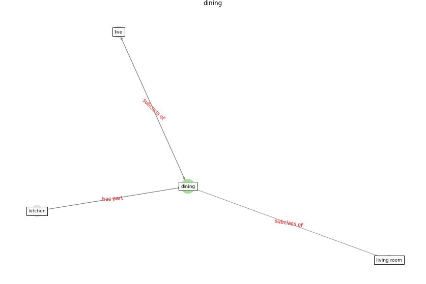

# Keyword: __dining__
## Clusters

* Cluster 4: [air-formaldehyde](cluster_4.md)

## Concepts

 

## Articles
* Prophylactic Architecture: Formulating the Concept
of Pandemic-Resilient Homes ([elrayies_prophylactic_2022](article_elrayies_prophylactic_2022.md))
* RESIDENTIAL ARCHITECTURE IN A POST-PANDEMIC
WORLD: IMPLICATIONS OF COVID-19 FOR NEW
CONSTRUCTION AND FOR ADAPTING HERITAGE
BUILDINGS ([spennemann_residential_2021](article_spennemann_residential_2021.md))
* Occupants’ behavior and activity patterns influencing
the energy consumption in the Kuwaiti residences ([al-mumin_occupants_2003](article_al-mumin_occupants_2003.md))
* realdania_refleksioner_2022_EN-1250 ([realdania_refleksioner_2022_EN-1250](article_realdania_refleksioner_2022_EN-1250.md))
* realdania_refleksioner_2022_EN-1500 ([realdania_refleksioner_2022_EN-1500](article_realdania_refleksioner_2022_EN-1500.md))
* realdania_refleksioner_2022_EN-150 ([realdania_refleksioner_2022_EN-150](article_realdania_refleksioner_2022_EN-150.md))
* realdania_refleksioner_2022_EN-1450 ([realdania_refleksioner_2022_EN-1450](article_realdania_refleksioner_2022_EN-1450.md))
* realdania_refleksioner_2022_EN-1400 ([realdania_refleksioner_2022_EN-1400](article_realdania_refleksioner_2022_EN-1400.md))
* realdania_refleksioner_2022_EN-1350 ([realdania_refleksioner_2022_EN-1350](article_realdania_refleksioner_2022_EN-1350.md))
* realdania_refleksioner_2022_EN-1300 ([realdania_refleksioner_2022_EN-1300](article_realdania_refleksioner_2022_EN-1300.md))
