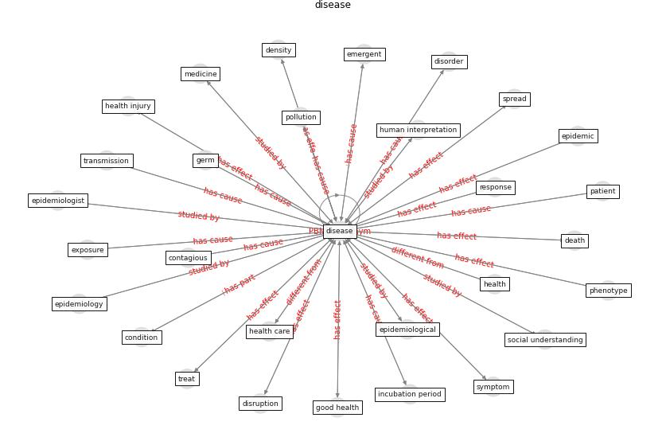

# Keyword: disease

* [urban-city](cluster_Cluster_12)

* [health-patient](cluster_Cluster_13)

* [malaria-vector](cluster_Cluster_14)

## Keywords

 * aedesaegypti, [airborne](keyword_airborne), airborne transmission, antibodie, asymptomatic, atrophy, [biodiversity](keyword_biodiversity), cardiovascular, [case](keyword_case), center, [chronic disease](keyword_chronic_disease), condition, contagious, [coronavirus](keyword_coronavirus), coronovirus, [covid-19](keyword_covid-19), cycle of poverty, death, [density](keyword_density), [disease](keyword_disease), disorder, disruption, economic damage, emergent, [epidemic](keyword_epidemic), [epidemiological](keyword_epidemiological), epidemiologist, [epidemiology](keyword_epidemiology), fear of contamination, germ, globalization, good health, [health](keyword_health), [health care](keyword_health_care), health sector, highly contagious, host, human interpretation, illness, immunity, incubation period, infect, [infection](keyword_infection), infectious, infectious condition, [infectious disease](keyword_infectious_disease), infectious pathogen, infectious risk, infective, infective dose, [influenza](keyword_influenza), isenabled, leprosy, lifecycle, low incidence, [malaria](keyword_malaria), manage epidemic, management, medicine, miasma, molecular, [mortality](keyword_mortality), [mosquito](keyword_mosquito), mosquito borne, neglect, neglect population, non competent host, [outbreak](keyword_outbreak), [pandemic](keyword_pandemic), parasite, [pathogen](keyword_pathogen), [patient](keyword_patient), phenotype, plague, [pollutant](keyword_pollutant), pollution, [population](keyword_population), predict the spread of the disease, [public health](keyword_public_health), [recovery](keyword_recovery), resistance, [respiratory](keyword_respiratory), response, [spread](keyword_spread), [symptom](keyword_symptom), [transmission](keyword_transmission), [travel](keyword_travel), treat, treatment, [tuberculosis](keyword_tuberculosis), [vbd](keyword_vbd), [vector](keyword_vector), vector borne, [vector borne disease](keyword_vector_borne_disease), vector control, [viral](keyword_viral), [virus](keyword_virus), yellow fever, zoonotic, zoonotic virus

## Concepts

 

## Neighbours

### Closest articles

* Decision Making within the Built Environment as a Strategy for Mitigating the Risk of Malaria and Other Vector-Borne Diseases - [LINK](article_obonyo_decision_2018)
* COVID-19 Could Leverage a Sustainable Built Environment - [LINK](article_pinheiro_covid-19_2020)
* Addressing vulnerability, building resilience: community-based adaptation to vector-borne diseases in the context of global change - [LINK](article_bardosh_addressing_2017)
* Challenges to Mitigating the Urban Health Burden of Mosquito-Borne Diseases in the Face of Climate Change - [LINK](article_ligsay_challenges_2021)
* A critical review of heating, ventilation, and air conditioning (HVAC) systems within the context of a global SARS-CoV-2 epidemic - [LINK](article_elsaid_critical_2021)
* The impact of climate change on the epidemiology and control of Rift Valley fever - PubMed - [LINK](article_martin_impact_2008)
* Epidemics, Planning and the City: A Special Issue of Planning Perspectives - [LINK](article_davis_epidemics_2022)
* Prototype Early Warning Systems for Vector-Borne Diseases in Europe - [LINK](article_semenza_prototype_2015)
* An Overview of Biomedical Ontologies for Pandemics and Infectious Diseases Representation - [LINK](article_bayoudhi_overview_2021)
* Future perspectives of wastewater-based epidemiology: Monitoring infectious disease spread and resistance to the community level - [LINK](article_sims_future_2020)

### Closest BPs

