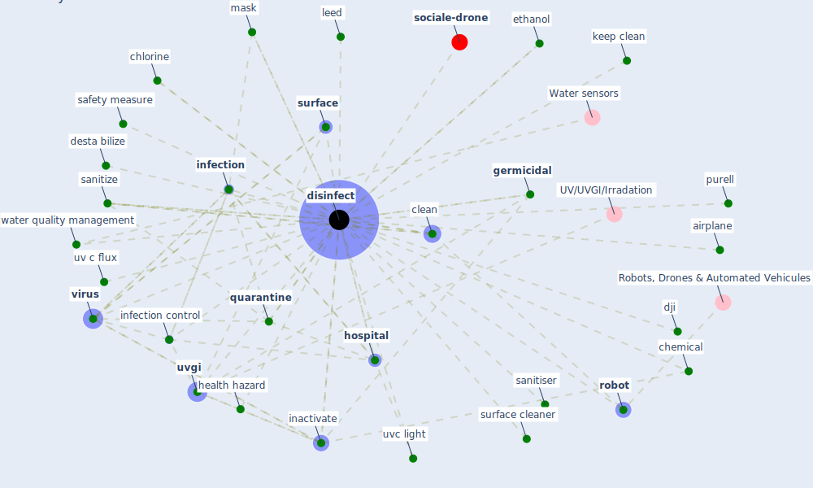

# Keyword: disinfect

* [sociale-drone](cluster_6)

## Keywords

 * Cluster_6, aerosolise, air dry, airplane, autonomous robot, bathroom, chemical, [chlorine](keyword_chlorine), [clean](keyword_clean), [computer](keyword_computer), desta bilize, dilute, [disinfect](keyword_disinfect), disinfect wipe, [disinfectant](keyword_disinfectant), disinfected, disinfecting, [disinfection](keyword_disinfection), disinfects, dji, eqach, ethanol, florence nightingale, [germicidal](keyword_germicidal), hand disinfecting, health hazard, [hospital](keyword_hospital), household waste, [hvac](keyword_hvac), [hvac system](keyword_hvac_system), hygiene, in duct hvac, inactivate, inactivate the virus, inactivation, [infection](keyword_infection), [infection control](keyword_infection_control), infectious waste, keep clean, [leed](keyword_leed), maintain, manage, [mask](keyword_mask), [monitor](keyword_monitor), purell, [quarantine](keyword_quarantine), [robot](keyword_robot), [robotic](keyword_robotic), [safety](keyword_safety), safety measure, sanitiser, sanitize, scrub, shoe, [surface](keyword_surface), surface cleaner, trombe wall, ultraviolet germicidal, upper room uv, upper room uvgi, [uv](keyword_uv), uv c flux, uv light source, [uv-c](keyword_uv-c), uvc light, uvg, uvg steriliser, [uvgi](keyword_uvgi), uvgi system, uvgi technology, [virus](keyword_virus), wash hand with soap, washing, [wastewater](keyword_wastewater), water quality management, worker safety

## Mapping

## Neighbours

### Closest articles

* Graphene-based nanomaterials as antimicrobial surface coatings: A parallel approach to restrain the expansion of COVID-19 - [LINK](article_ayub_graphene-based_2021)
* Readiness Assessment of Green Building Certification Systems for Residential Buildings during Pandemics - [LINK](article_tleuken_readiness_2021)
* Designing Post COVID-19 Buildings: Approaches for Achieving Healthy Buildings - [LINK](article_navaratnam_designing_2022)
* Toilets dominate environmental detection of SARS-CoV-2 virus in a hospital - [LINK](article_ding_toilets_2020)
* The Effects of Pandemic on Construction Industry in the UK - [LINK](article_shibani_effects_2020)
* Upper-room ultraviolet air disinfection might help to reduce COVID-19 transmission in buildings: a feasibility study - [LINK](article_beggs_upper-room_2020)
* A review of facilities management interventions to mitigate respiratory infections in existing buildings - [LINK](article_zhang_review_2022)
* Recently employed engineering techniques to reduce the spread of COVID-19 (corona virus disease 2019): a review study - [LINK](article_saman_recently_2021)
* A Review on Building Design as a Biomedical System for Preventing COVID-19 Pandemic - [LINK](article_amran_review_2022)
* Disinfection technology of hospital wastes and wastewater: Suggestions for disinfection strategy during coronavirus Disease 2019 (COVID-19) pandemic in China - [LINK](article_wang_disinfection_2020)

### Closest BPs

