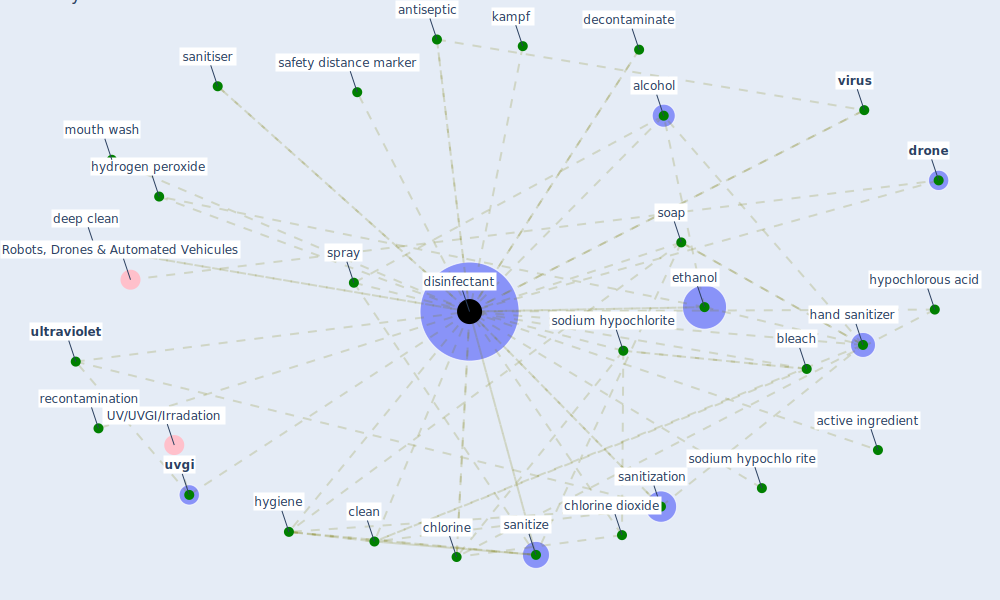

# Keyword: disinfectant

## Keywords

 * 2 propanol, 2 propanol with 1 propanol, active ingredient, addition equipment, alcohol, alcoholic, [antibiotic](keyword_antibiotic), [antimicrobial](keyword_antimicrobial), antiseptic, [antiviral](keyword_antiviral), biocidal, bleach, calcium hypochlorite, chlorinate, [chlorine](keyword_chlorine), chlorine contain disinfectant, [chlorine dioxide](keyword_chlorine_dioxide), cinatl, [clean](keyword_clean), clean detergent, container, [coronavirus](keyword_coronavirus), [covid 19 pandemic](keyword_covid_19_pandemic), decontaminate, deep clean, detergent, [disinfect](keyword_disinfect), [disinfectant](keyword_disinfectant), disinfectant addition equipment, disinfectant drone, disinfectants, [disinfection](keyword_disinfection), [drone](keyword_drone), efficient, environment factor, epa list, epa list n certified, ethanol, ethanolbase disinfectant, hand sanitizer, hand wash, [hospital](keyword_hospital), human life, hydrogen peroxide, hygiene, hygiene care, hypochlorous acid, in vitro, inactivate, [kampf](keyword_kampf), lift pump, liquid, liquid chlorine, liquid disinfectant, list n disinfectant, list n disinfectant for use against sar cov 2, list of disinfectant active on virus, literature, metallic nanoparticle, mouth wash, ozone ozone, point of contact, public disinfectant container, rapid, recontamination, risk reduction, role, safe distance marker, safety distance marker, sanitiser, sanitization, sanitize, sanitizer, [sar cov 2](keyword_sar_cov_2), sars coronavirus, shoe sink, soap, sodium hypochlo rite, sodium hypochlorite, solid, spray, spray button, spray disinfectant, standard disinfectant, sterilisation, sterilise, sterilization, [sunlight](keyword_sunlight), surface cleaner, [sustainability](keyword_sustainability), [ultraviolet](keyword_ultraviolet), upper room ultraviolet, uv c flux, uv irradiation, [uvgi](keyword_uvgi), vacuum siphon fixe ratio chlorine dosing system, [virus](keyword_virus), washing

## Mapping

## Neighbours

### Closest articles

* Disinfection technology of hospital wastes and wastewater: Suggestions for disinfection strategy during coronavirus Disease 2019 (COVID-19) pandemic in China - [LINK](article_wang_disinfection_2020)
* Sustainability of Coronavirus on Different Surfaces - [LINK](article_suman_sustainability_2020)
* Persistence of coronaviruses on inanimate surfaces and their inactivation with biocidal agents - [LINK](article_kampf_persistence_2020)
* Graphene-based nanomaterials as antimicrobial surface coatings: A parallel approach to restrain the expansion of COVID-19 - [LINK](article_ayub_graphene-based_2021)
* COVID-19 Pandemic: Prevention and Protection Measures to Be Adopted at the Workplace - [LINK](article_cirrincione_covid-19_2020)
* COVID-19 Could Leverage a Sustainable Built Environment - [LINK](article_pinheiro_covid-19_2020)
* Assessment method for new sustainability indicators providing pandemic resilience for residential buildings - [LINK](article_tokazhanov_assessment_2021)
* A review of facilities management interventions to mitigate respiratory infections in existing buildings - [LINK](article_zhang_review_2022)
* Designing Post COVID-19 Buildings: Approaches for Achieving Healthy Buildings - [LINK](article_navaratnam_designing_2022)
* A Continuously Active Antimicrobial Coating effective against Human Coronavirus 229E - [LINK](article_ikner_continuously_2020)

### Closest BPs

