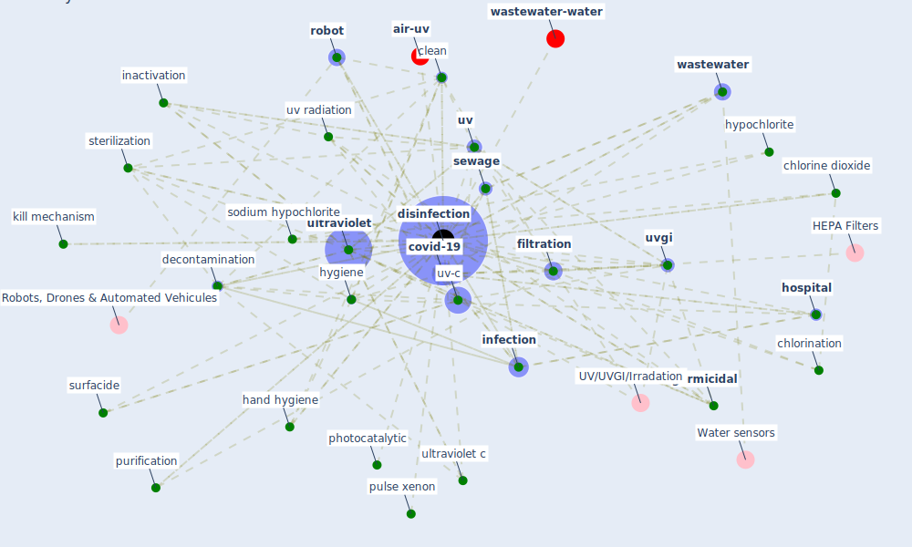

# Keyword: disinfection

* [wastewater-water](cluster_0)

* [air-uv](cluster_10)

## Keywords

 * adverse health effect, [air](keyword_air), airborne virus, airstream, alcohol, alternative approach to disinfection, antibacterial, [antimicrobial](keyword_antimicrobial), autonomous disinfection robot, bleaching powder, carrier test, chemical, chlorination, [chlorine](keyword_chlorine), [chlorine dioxide](keyword_chlorine_dioxide), classification, [clean](keyword_clean), clean their home, cleanli ness, combat, community transmission, covid 19 pandemic in china, [covid-19](keyword_covid-19), [decontamination](keyword_decontamination), [disinfectant](keyword_disinfectant), [disinfection](keyword_disinfection), disposal, drink water, efficient, fil tration, [filtration](keyword_filtration), [germicidal](keyword_germicidal), hand hygiene, hand washing, hazardous, high temperature incineration, high temperature steam disinfection, [hospital](keyword_hospital), household waste, hydrogen peroxide, hygiene, hypochlorite, in duct air disinfection system, inactivation, incineration, indoor surface, [infection](keyword_infection), [infection control](keyword_infection_control), kill mechanism, memarzadeh, microwave disinfection, ozone disinfection, ozonization, photocatalytic, polimeni, ppe protocol, product, protective material, pulse xenon, purification, purify process, [quarantine](keyword_quarantine), residual, respirator, [robot](keyword_robot), [safety](keyword_safety), [sanitation](keyword_sanitation), sanitization, sanitize, self hygiene, self reactivation, [sewage](keyword_sewage), soap, sodium hypochlorite, spray, sterilisation, sterilization, [surfacide](keyword_surfacide), suspension test, [toilet](keyword_toilet), toilet flush, treatment technology, ugi, ugi design basic, [ultraviolet](keyword_ultraviolet), ultraviolet c, ultraviolet germicidal, ultraviolet shelter, [uv](keyword_uv), uv irradiation, uv lamp, uv radiation, [uv-c](keyword_uv-c), [uvgi](keyword_uvgi), virus propagation, waste separation, [wastewater](keyword_wastewater), water disinfection, wm3, filtration

## Mapping

## Neighbours

### Closest articles

* Disinfection technology of hospital wastes and wastewater: Suggestions for disinfection strategy during coronavirus Disease 2019 (COVID-19) pandemic in China - [LINK](article_wang_disinfection_2020)
* Applications of ultraviolet germicidal irradiation disinfection in health care facilities: Effective adjunct, but not stand-alone technology - [LINK](article_memarzadeh_applications_2010)
* SARS-CoV-2 RNA detection of hospital isolation wards hygiene monitoring during the Coronavirus Disease 2019 outbreak in a Chinese hospital - [LINK](article_wang_sars-cov-2_2020)
* Methods for air cleaning and protection of building occupants from airborne pathogens - [LINK](article_bolashikov_methods_2009)
* Upper-room ultraviolet air disinfection might help to reduce COVID-19 transmission in buildings: a feasibility study - [LINK](article_beggs_upper-room_2020)
* A review of facilities management interventions to mitigate respiratory infections in existing buildings - [LINK](article_zhang_review_2022)
* Graphene-based nanomaterials as antimicrobial surface coatings: A parallel approach to restrain the expansion of COVID-19 - [LINK](article_ayub_graphene-based_2021)
* Persistence of coronaviruses on inanimate surfaces and their inactivation with biocidal agents - [LINK](article_kampf_persistence_2020)
* Indoor Air Quality: Rethinking rules of building design strategies in post-pandemic architecture - [LINK](article_megahed_indoor_2021)
* Air Disinfection for Airborne Infection Control with a Focus on COVID‐19: Why Germicidal UV is Essential             † - [LINK](article_nardell_air_2021)

### Closest BPs

