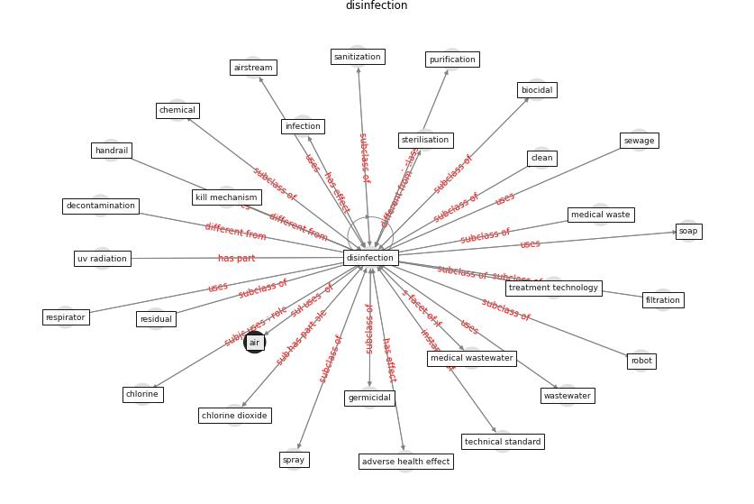

# Keyword: __disinfection__
## Clusters

* Cluster 15: [water-wastewater](cluster_15)

## Concepts

 

## Top 10 articles for __disinfection__
* Disinfection technology of hospital wastes and wastewater:
Suggestions for disinfection strategy during coronavirus
Disease 2019 (COVID-19) pandemic in China ([wang_disinfection_2020](article_wang_disinfection_2020))
* SARS-CoV-2 RNA detection of hospital isolation wards
hygiene monitoring during the Coronavirus Disease 2019
outbreak in a Chinese hospital ([wang_sars-cov-2_2020](article_wang_sars-cov-2_2020))
* Applications of ultraviolet germicidal irradiation
disinfection in health care facilities: Effective
adjunct, but not stand-alone technology ([memarzadeh_applications_2010](article_memarzadeh_applications_2010))
* Methods for air cleaning and protection of building
occupants from airborne pathogens ([bolashikov_methods_2009](article_bolashikov_methods_2009))
* Upper-room ultraviolet air disinfection might help to
reduce COVID-19 transmission in buildings: a feasibility
study ([beggs_upper-room_2020](article_beggs_upper-room_2020))
* Persistence of coronaviruses on inanimate surfaces and
their inactivation with biocidal agents ([kampf_persistence_2020](article_kampf_persistence_2020))
* Indoor Air Quality: Rethinking rules of building
design strategies in post-pandemic architecture ([megahed_indoor_2021](article_megahed_indoor_2021))
* A review of facilities management interventions to
mitigate respiratory infections in existing buildings ([zhang_review_2022](article_zhang_review_2022))
* Graphene-based nanomaterials as antimicrobial surface
coatings: A parallel approach to restrain the expansion
of COVID-19 ([ayub_graphene-based_2021](article_ayub_graphene-based_2021))
* Air Disinfection for Airborne Infection Control
with a Focus on COVID-19: Why Germicidal UV is
Essential† ([nardell_air_2021](article_nardell_air_2021))
