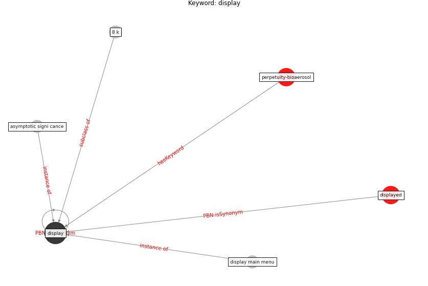

# Keyword: display

* [perpetuity-bioaerosol](cluster_Cluster_3)

## Keywords

 * 8 k, Cluster_3, asymptotic signi cance, [display](keyword_display), display main menu, displayed

## Concepts

 

## Neighbours

### Closest articles

* Overcoming the Impact of COVID-19 Using Integrated Project Delivery Model - [LINK](article_g_overcoming_2020)
* Future (post-COVID) digital, smart and sustainable cities in the wake of 6G: Digital twins, immersive realities and new urban economies - [LINK](article_allam_future_2021)
* Risk Diagnosis and Mitigation System of COVID-19 Using Expert System and Web Scraping - [LINK](article_mufid_risk_2020)

### Closest BPs

