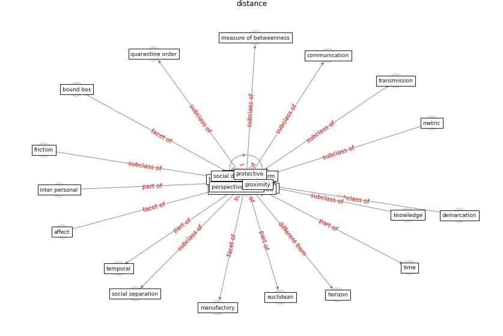

# Keyword: __distance__
## Clusters

* Cluster 7: [tourism-tourist](cluster_7)

## Concepts

 

## Top 10 articles for __distance__
* realdania_refleksioner_2022_EN ([realdania_refleksioner_2022_EN](article_realdania_refleksioner_2022_EN))
* COVID-19 Could Leverage a Sustainable Built
Environment ([pinheiro_covid-19_2020](article_pinheiro_covid-19_2020))
* Seeing the invisible hand: Underlying effects of
COVID-19 on tourists’ behavioral patterns ([li_seeing_2020](article_li_seeing_2020))
* DeepSOCIAL: Social Distancing Monitoring and
Infection Risk Assessment in COVID-19 Pandemic ([rezaei_deepsocial_2020](article_rezaei_deepsocial_2020))
* Study of COVID-19 pandemic in London (UK) from urban
context ([ghosh_study_2020](article_ghosh_study_2020))
* How the 5G Enabled the COVID-19 Pandemic
Prevention and Control: Materiality, Affordance,
and (De-)Spatialization ([li_how_2022](article_li_how_2022))
* Design COVID-19 Ontology: A Healthcare and
Safety Perspective ([aloulou_design_2022](article_aloulou_design_2022))
* Influence between COVID-19 Impacts and Project
Stakeholders in Chilean Construction Projects ([araya_influence_2021](article_araya_influence_2021))
* Towards the sustainable development of smart cities
through mass video surveillance: A response to the
COVID-19 pandemic ([shorfuzzaman_towards_2021](article_shorfuzzaman_towards_2021))
* Exploring the Non-Medical impacts of Covid-19 using
Natural Language Processing ([agade_exploring_2020](article_agade_exploring_2020))
