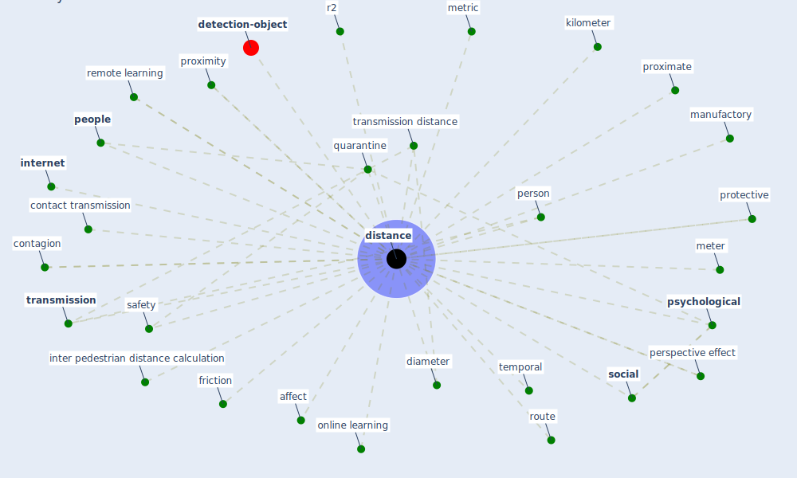

# Keyword: distance

* [detection-object](cluster_8)

## Keywords

 * Cluster_8, affect, average profile, betweenness, [bound box](keyword_bound_box), chi square distance, [city](keyword_city), contact transmission, contagion, couple, couple member, [covid-19](keyword_covid-19), dangerous, diameter, direction, disease transmission, [distance](keyword_distance), distance from the origin of the graphic, distances, distancing, euclidean, far, friction, friction of distance, [horizon](keyword_horizon), inter pedestrian distance calculation, inter personal, [internet](keyword_internet), kilometer, manufactory, measure of betweenness, measurement, meter, metric, midpoint, minimize contact, online learning, [people](keyword_people), person, perspective effect, probability density, probability of contagion, protective, proximate, proximity, [psychological](keyword_psychological), quarantine, quarantine order, r2, remote learning, respiratory droplet, [route](keyword_route), [safety](keyword_safety), separation, [social](keyword_social), temporal, threshold, time gap, topic_term distance, [transmission](keyword_transmission), transmission distance

## Mapping

## Neighbours

### Closest articles

* DeepSOCIAL: Social Distancing Monitoring and Infection Risk Assessment in COVID-19 Pandemic - [LINK](article_rezaei_deepsocial_2020)
* COVID-19 Could Leverage a Sustainable Built Environment - [LINK](article_pinheiro_covid-19_2020)
* Design COVID-19 Ontology: A Healthcare and Safety Perspective - [LINK](article_aloulou_design_2022)
* How the 5G Enabled the COVID-19 Pandemic Prevention and Control: Materiality, Affordance, and (De-)Spatialization - [LINK](article_li_how_2022)
* Seeing the invisible hand: Underlying effects of COVID-19 on tourists’ behavioral patterns - [LINK](article_li_seeing_2020)
* Influence between COVID-19 Impacts and Project Stakeholders in Chilean Construction Projects - [LINK](article_araya_influence_2021)
* The efficacy of social distance and ventilation effectiveness in preventing COVID-19 transmission - [LINK](article_sun_efficacy_2020)
* COVID-ABS: An agent-based model of COVID-19 epidemic to simulate health and economic effects of social distancing interventions - [LINK](article_silva_covid-abs_2020)
* Study of COVID-19 pandemic in London (UK) from urban context - [LINK](article_ghosh_study_2020)
* Social distancing enhanced automated optimal design of physical spaces in the wake of the COVID-19 pandemic - [LINK](article_ugail_social_2021)

### Closest BPs

