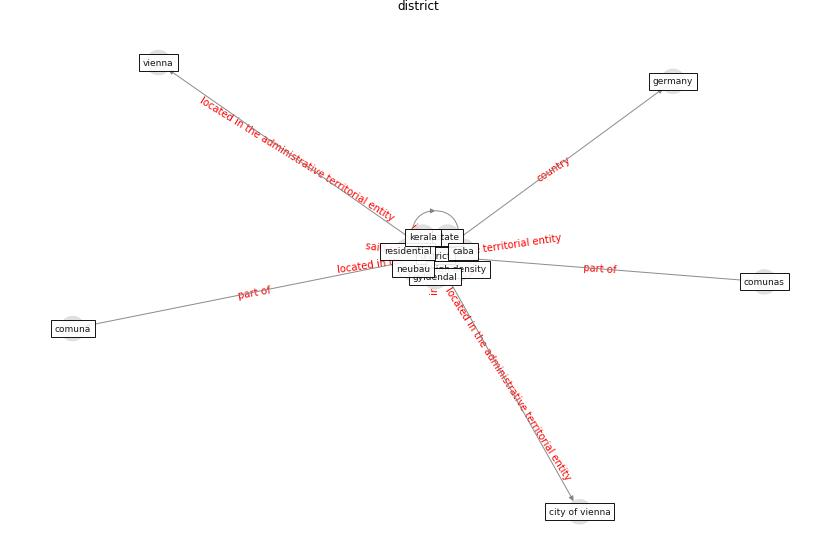

# Keyword: __district__
## Clusters

* Cluster 15: [green-urban](cluster_15)

## Concepts

 

## Top 10 articles for __district__
* Green in times of COVID-19: urban green space relevance
during the COVID-19 pandemic in Buenos Aires City ([marconi_green_2022](article_marconi_green_2022))
* Urban Green Infrastructure and Green Open
Spaces: An Issue of Social Fairness in Times of
COVID-19 Crisis ([reinwald_urban_2021](article_reinwald_urban_2021))
* Exploring the Non-Medical impacts of Covid-19 using
Natural Language Processing ([agade_exploring_2020](article_agade_exploring_2020))
* COVID-19 and Green Housing: A Review of
Relevant Literature ([kaklauskas_covid-19_2021](article_kaklauskas_covid-19_2021))
* Scalable IoT Architecture for Monitoring IEQ
Conditions in Public and Private Buildings ([calvo_scalable_2022](article_calvo_scalable_2022))
* realdania_refleksioner_2022 ([realdania_refleksioner_2022](article_realdania_refleksioner_2022))
* The socio-economic determinants of COVID-19: A spatial
analysis of German county level data ([ehlert_socio-economic_2021](article_ehlert_socio-economic_2021))
* Treating two pandemics for the price of one: Chronic and
infectious disease impacts of the built and natural
environment ([frank_treating_2021](article_frank_treating_2021))
* realdania_refleksioner_2022_EN ([realdania_refleksioner_2022_EN](article_realdania_refleksioner_2022_EN))
* Learning from pandemics: Applying resilience thinking to
identify priorities for planning urban settlements ([syal_learning_2021](article_syal_learning_2021))
