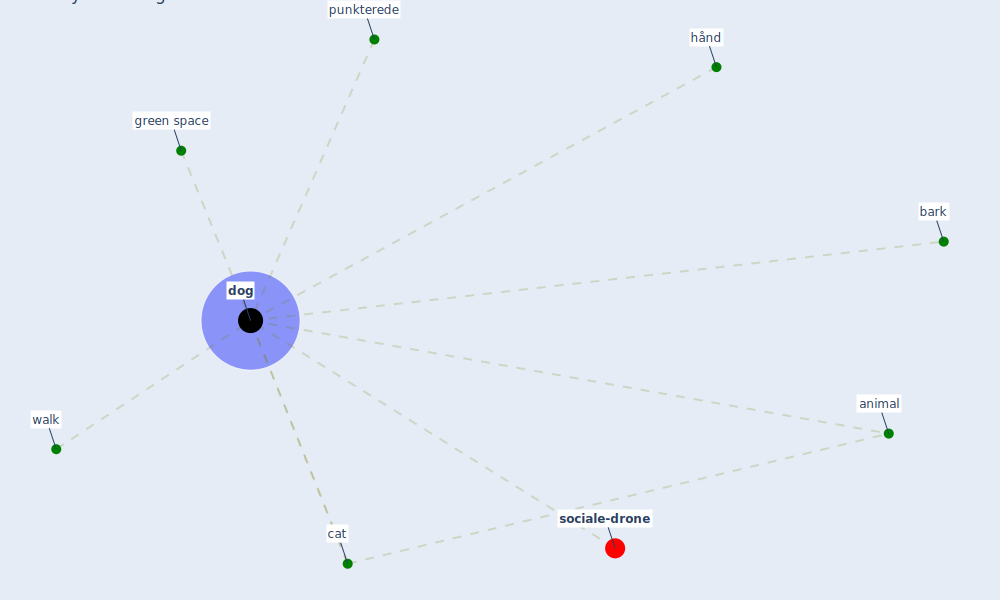

# Keyword: dog

* [sociale-drone](cluster_6)

## Keywords

 * Cluster_6, animal, bark, cat, [dog](keyword_dog), [green space](keyword_green_space), hånd, punkterede, walk

## Mapping

## Neighbours

### Closest articles

* Making green infrastructure healthier infrastructure - [LINK](article_lohmus_making_2015)
* Green infrastructure through the lens of “One Health”: A systematic review and integrative framework uncovering synergies and trade-offs between mental health and wildlife support in cities - [LINK](article_felappi_green_2020)
* Attitudes towards outdoor and neighbour noise during the COVID-19 lockdown: A case study in London - [LINK](article_lee_attitudes_2021)
* Refleksioner fra en pandemi - [LINK](article_realdania_refleksioner_2022)
* Effects of the COVID-19 pandemic on the use and perceptions of urban green space: An international exploratory study - [LINK](article_ugolini_effects_2020)

### Closest BPs

