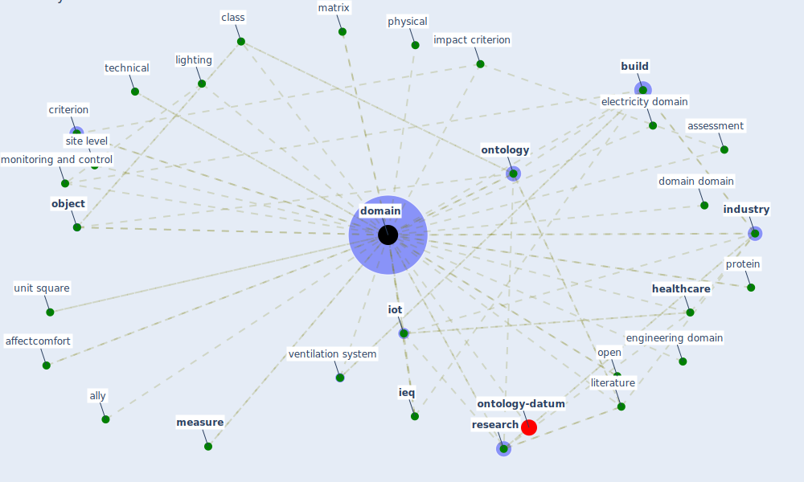

# Keyword: domain

* [ontology-datum](cluster_12)

## Keywords

 * Cluster_12, affectcomfort, ally, [application](keyword_application), application ontology, assessment, [build](keyword_build), [building](keyword_building), building bac, building building, building building domain, building sector, building service, case case c c, cell membrane, class, class class, criterion, discourse, docertainor, docertainor system, [domain](keyword_domain), domain domain, domain expert, domain type, domains, dynamic envelope, [economic](keyword_economic), electricity, electricity domain, [engineering](keyword_engineering), engineering domain, ent, ent domain, expert, financial, [healthcare](keyword_healthcare), healthcare domain, healthcare industry, [housing](keyword_housing), huppert, [ieq](keyword_ieq), [impact](keyword_impact), impact criterion, [industry](keyword_industry), [iot](keyword_iot), job quality, landscape level, landscape level factors, lighting, lighting domain, literature, lu, matrix, [measure](keyword_measure), monitoring and control, [object](keyword_object), [ontology](keyword_ontology), open, origin, [outbreak](keyword_outbreak), [patient](keyword_patient), peptide, performance matrix, [physical](keyword_physical), protein, [quality](keyword_quality), radius, rcgp, [research](keyword_research), resilient network, [room](keyword_room), site level, [social](keyword_social), storage, sustainable city and society, technical, telecommunication, theisbrain, [transport policy](keyword_transport_policy), transportation, type, unit square, urban region, variable, [ventilation](keyword_ventilation), ventilation system, ω0

## Mapping

## Neighbours

### Closest articles

* Assessment of Building Automation and Control Systems in Danish Healthcare Facilities in the COVID-19 Era - [LINK](article_pedersen_assessment_2022)
* An Overview of Biomedical Ontologies for Pandemics and Infectious Diseases Representation - [LINK](article_bayoudhi_overview_2021)
* Social distancing enhanced automated optimal design of physical spaces in the wake of the COVID-19 pandemic - [LINK](article_ugail_social_2021)
* Respiratory pandemics, urban planning and design: A multidisciplinary rapid review of the literature - [LINK](article_harris_respiratory_2022)
* A review of definitions and measures of system resilience - [LINK](article_hosseini_review_2016)
* Continuous IEQ monitoring system: Context and development - [LINK](article_parkinson_continuous_2019)
* Sustainable work throughout the life course: National policies and strategies, Publications Office of the European Union - [LINK](article_eurofund_sustainable_2016)
* Green infrastructure through the lens of “One Health”: A systematic review and integrative framework uncovering synergies and trade-offs between mental health and wildlife support in cities - [LINK](article_felappi_green_2020)
* Exploring the Non-Medical impacts of Covid-19 using Natural Language Processing - [LINK](article_agade_exploring_2020)
* Far-UVC light (222 nm) efficiently and safely inactivates airborne human coronaviruses - [LINK](article_buonanno_far-uvc_2020)

### Closest BPs

