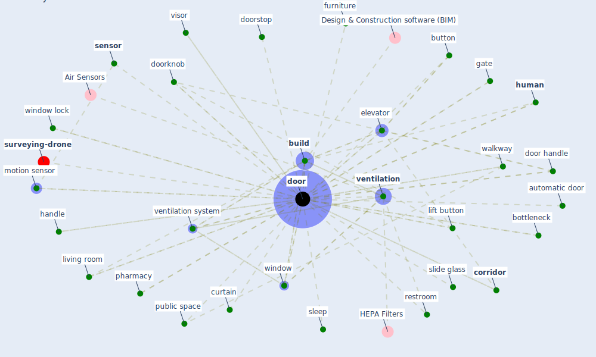

# Keyword: door

* [surveying-drone](cluster_13)

## Keywords

 * Cluster_13, airlock, automatic door, bottleneck, [build](keyword_build), button, [corridor](keyword_corridor), curtain, delivery hatch, [door](keyword_door), door handle, doorknob, doors, doorstop, elevator, furniture, [gate](keyword_gate), glass, handle, [human](keyword_human), knob, lift button, living room, motion sensor, office building, pharmacy, [public space](keyword_public_space), restroom, [room](keyword_room), self closing, [sensor](keyword_sensor), sickbe, [sleep](keyword_sleep), slide glass, smartphone lift, [space](keyword_space), [ventilation](keyword_ventilation), ventilation system, vestibule, visor, walkway, [window](keyword_window), window lock

## Mapping

## Neighbours

### Closest articles

* The Effect of Opening Windows on Air Change Rates in Two Homes - [LINK](article_howard-reed_effect_2002)
* Prophylactic Architecture: Formulating the Concept of Pandemic-Resilient Homes - [LINK](article_elrayies_prophylactic_2022)
* A Review on Building Design as a Biomedical System for Preventing COVID-19 Pandemic - [LINK](article_amran_review_2022)
* Social distancing enhanced automated optimal design of physical spaces in the wake of the COVID-19 pandemic - [LINK](article_ugail_social_2021)
* Retail Signage During the COVID-19 Pandemic - [LINK](article_mcneish_retail_2020)
* Designing Post COVID-19 Buildings: Approaches for Achieving Healthy Buildings - [LINK](article_navaratnam_designing_2022)
* Scalable IoT Architecture for Monitoring IEQ Conditions in Public and Private Buildings - [LINK](article_calvo_scalable_2022)
* Architectural design strategies for infection prevention and control (IPC) in health-care facilities: towards curbing the spread of Covid-19 \textbar SpringerLink - [LINK](article_udomiaye_architectural_2020)
* RESIDENTIAL ARCHITECTURE IN A POST-PANDEMIC WORLD: IMPLICATIONS OF COVID-19 FOR NEW CONSTRUCTION AND FOR ADAPTING HERITAGE BUILDINGS - [LINK](article_spennemann_residential_2021)
* How is COVID-19 Experience Transforming Sustainability Requirements of Residential Buildings? A Review - [LINK](article_tokazhanov_how_2020)

### Closest BPs

