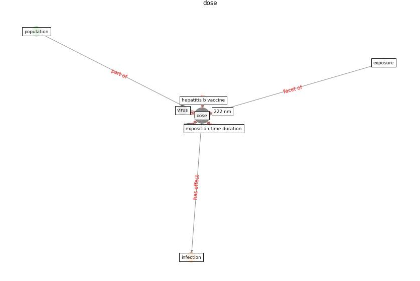

# Keyword: __dose__
## Clusters

* Cluster 2: [uv-room](cluster_2)
* Cluster 5: [uvc-hcov](cluster_5)

## Concepts

 

## Top 10 articles for __dose__
* Exploring the Non-Medical impacts of Covid-19 using
Natural Language Processing ([agade_exploring_2020](article_agade_exploring_2020))
* Far-UVC light (222 nm) efficiently and safely
inactivates airborne human coronaviruses ([buonanno_far-uvc_2020](article_buonanno_far-uvc_2020))
* Air Disinfection for Airborne Infection Control
with a Focus on COVID-19: Why Germicidal UV is
Essential† ([nardell_air_2021](article_nardell_air_2021))
* A Comprehensive Review of the COVID-19 Pandemic
and the Role of IoT, Drones, AI, Blockchain, and
5G in Managing its Impact ([chamola_comprehensive_2020](article_chamola_comprehensive_2020))
* Recently employed engineering techniques to reduce the
spread of COVID-19 (corona virus disease 2019): a review
study ([saman_recently_2021](article_saman_recently_2021))
* Effect of Ultraviolet Germicidal Irradiation on
Viral Aerosols ([walker_effect_2007](article_walker_effect_2007))
