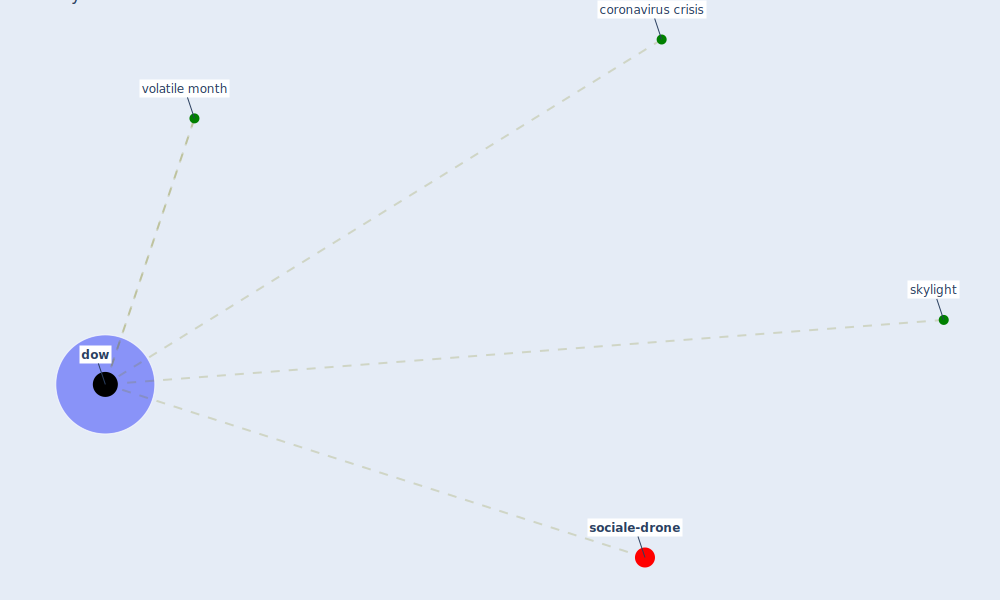

# Keyword: dow

* [sociale-drone](cluster_6)

## Keywords

 * Cluster_6, coronavirus crisis, [dow](keyword_dow), dows, skylight, volatile month

## Mapping

## Neighbours

### Closest articles

* How COVID-19 Redefines the Concept of Sustainability - [LINK](article_hakovirta_how_2020)
* Strategies to Mitigate COVID-19 Pandemic Impacts on Health and Safety of Workers in Construction Projects - [LINK](article_kaushal_strategies_2021)
* Assessment of Building Automation and Control Systems in Danish Healthcare Facilities in the COVID-19 Era - [LINK](article_pedersen_assessment_2022)

### Closest BPs

