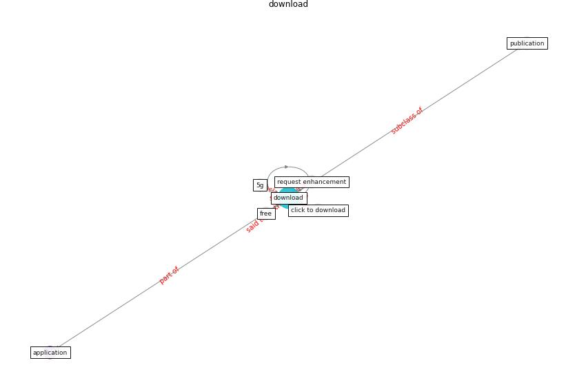

# Keyword: __download__
## Clusters

* Cluster 14: [onlinelibrary-wiley](cluster_14)

## Concepts

 

## Articles
* The Socio-Spatial Determinants of COVID-19
Diffusion: The Impact of Globalisation,
Settlement Characteristics and Population ([sigler_socio-spatial_2020](article_sigler_socio-spatial_2020))
* Mobile Technology Solution for COVID-19:
Surveillance and Prevention ([raza_mobile_2021](article_raza_mobile_2021))
* COVID-19 and Green Housing: A Review of
Relevant Literature ([kaklauskas_covid-19_2021](article_kaklauskas_covid-19_2021))
* A Global Survey of Infection Control and
Mitigation Measures for Combating the Transmission
of COVID-19 Pandemic in Buildings Under
Facilities Management Services ([sarvari_global_2022](article_sarvari_global_2022))
* Design COVID-19 Ontology: A Healthcare and
Safety Perspective ([aloulou_design_2022](article_aloulou_design_2022))
* How the 5G Enabled the COVID-19 Pandemic
Prevention and Control: Materiality, Affordance,
and (De-)Spatialization ([li_how_2022](article_li_how_2022))
* A Global Survey of Infection Control and
Mitigation Measures for Combating the Transmission
of COVID-19 Pandemic in Buildings Under
Facilities Management Services ([sarvari_global_2022](article_sarvari_global_2022))
* Covid-19 Associated Risks and Mitigation
Strategies relevant for the UK Construction
Industry ([dan-jumbo_covid-19_2021](article_dan-jumbo_covid-19_2021))
* Borders and Catastrophe: lessons from COVID-19 for the
European Green Deal ([klein_borders_2021](article_klein_borders_2021))
* RUDDS_bioRxiv_update ([RUDDS_bioRxiv_update](article_RUDDS_bioRxiv_update))
