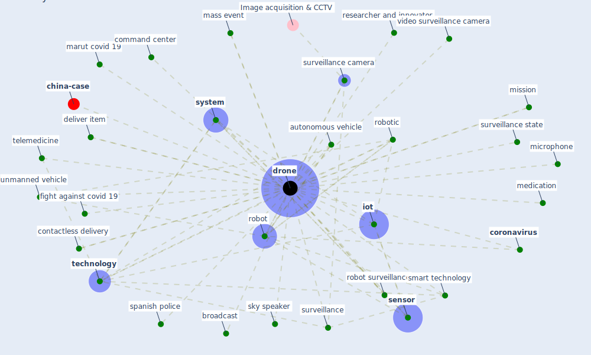

# Keyword: drone

* [china-case](cluster_5)

## Keywords

 * Cluster_5, amazon, autonomous delivery, autonomous robot, autonomous vehicle, aviation, beyond visible line of sight, [blockchain](keyword_blockchain), broadcast, [china](keyword_china), command center, contact, contactless delivery, [coronavirus](keyword_coronavirus), [covid-19](keyword_covid-19), crowd surveillance, cyberient, deliver item, deliver medication, [delivery](keyword_delivery), [disinfectant](keyword_disinfectant), [drone](keyword_drone), drone technology, [epidemic](keyword_epidemic), fight against covid 19, ground vehicle, [healthcare](keyword_healthcare), healthcare support, iccc, infrared camera, [iot](keyword_iot), law enforcement agency, marut covid, marut covid 19, mass event, medication, medicine, micromulticopter, microphone, mission, monitor platform, public announcement, [researcher](keyword_researcher), researcher and innovator, robakowska, [robot](keyword_robot), robot surveillance, robot technologies, [robotic](keyword_robotic), [sensor](keyword_sensor), sky speaker, smart technology, spanish police, spray disinfectant, [surveillance](keyword_surveillance), surveillance camera, surveillance state, [system](keyword_system), [technology](keyword_technology), [telemedicine](keyword_telemedicine), unmanned vehicle, video surveillance camera

## Mapping

## Neighbours

### Closest articles

* A Comprehensive Review of the COVID-19 Pandemic and the Role of IoT, Drones, AI, Blockchain, and 5G in Managing its Impact - [LINK](article_chamola_comprehensive_2020)
* Drones. Disinfecting robots. Supercomputers. The coronavirus outbreak is a test for China's tech industry \textbar CNN Business - [LINK](article_wang_drones_2020)
* Recently employed engineering techniques to reduce the spread of COVID-19 (corona virus disease 2019): a review study - [LINK](article_saman_recently_2021)
* How drones help cities during the Covid-19 pandemic \textbar TheMayor.EU - [LINK](article_dimitrova_how_2021)
*  - [LINK](article_mehtab_alam_role_2021)
* Towards the sustainable development of smart cities through mass video surveillance: A response to the COVID-19 pandemic - [LINK](article_shorfuzzaman_towards_2021)
* Impact of COVID-19 on IoT Adoption in Healthcare, Smart Homes, Smart Buildings, Smart Cities, Transportation and Industrial IoT - [LINK](article_umair_impact_2021)
* An Automated System to Limit COVID-19 Using Facial Mask Detection in Smart City Network - [LINK](article_rahman_automated_2020)
* DeepSOCIAL: Social Distancing Monitoring and Infection Risk Assessment in COVID-19 Pandemic - [LINK](article_rezaei_deepsocial_2020)
* 10 tech trends getting us through the COVID-19 pandemic - [LINK](article_yan_10_2020)

### Closest BPs

