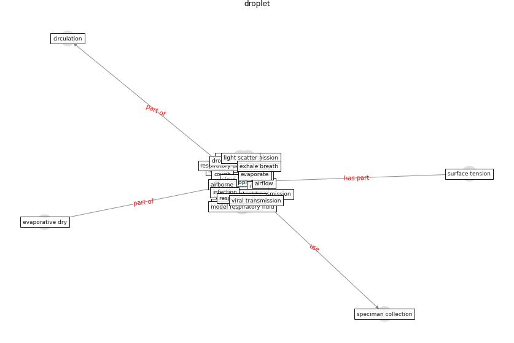

# Keyword: __droplet__
## Clusters

* Cluster 8: [air-ventilation](cluster_8)

## Concepts

 

## Articles
* A Review on Building Design as a Biomedical
System for Preventing COVID-19 Pandemic ([amran_review_2022](article_amran_review_2022))
* Methods for air cleaning and protection of building
occupants from airborne pathogens ([bolashikov_methods_2009](article_bolashikov_methods_2009))
* ashrae_ashrae_2022-100 ([ashrae_ashrae_2022-100](article_ashrae_ashrae_2022-100))
* The ventilation of buildings and other mitigating measures
for COVID-19: a focus on wintertime ([burridge_ventilation_2021](article_burridge_ventilation_2021))
* Applications of ultraviolet germicidal irradiation
disinfection in health care facilities: Effective
adjunct, but not stand-alone technology ([memarzadeh_applications_2010](article_memarzadeh_applications_2010))
* 2019 Novel Coronavirus (COVID-19) Pandemic:
Built Environment Considerations To Reduce
Transmission ([dietz_2019_2020](article_dietz_2019_2020))
* The ventilation of buildings and other mitigating measures
for COVID-19: a focus on wintertime ([burridge_ventilation_2021](article_burridge_ventilation_2021))
* The ventilation of buildings and other mitigating measures
for COVID-19: a focus on wintertime ([burridge_ventilation_2021](article_burridge_ventilation_2021))
* How can airborne transmission of COVID-19 indoors be
minimised? ([morawska_how_2020](article_morawska_how_2020))
* ashrae_ashrae_2022-50 ([ashrae_ashrae_2022-50](article_ashrae_ashrae_2022-50))
