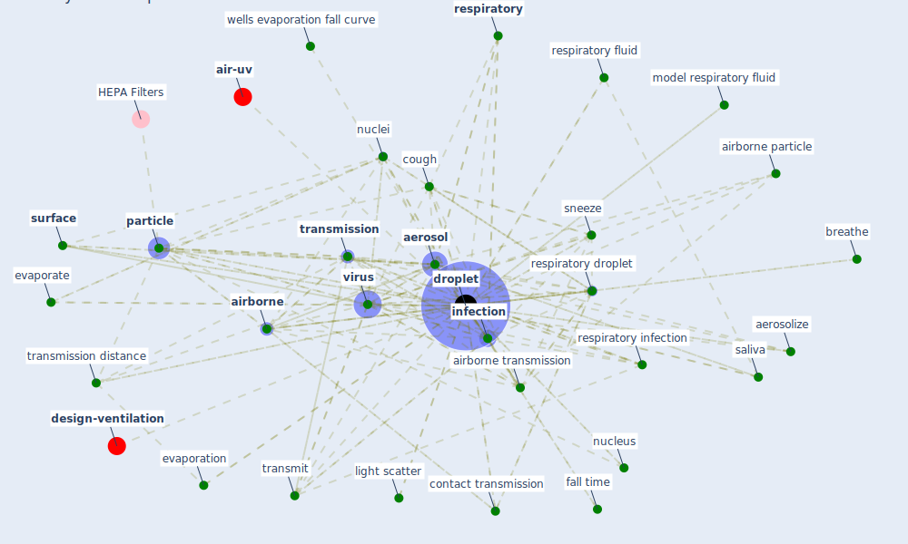

# Keyword: droplet

## Keywords

 * [aerosol](keyword_aerosol), aerosol particle, aerosol transmission, aerosolize, [air](keyword_air), air distribution, air jet, [airborne](keyword_airborne), airborne particle, airborne transmission, airborne transmission of disease, airborne transmission route, airflow, ballistically, breathe, cigarette smoke, con19, contact, contact transmission, cough, [covid-19](keyword_covid-19), diameter, dispersal, disposable mask respirator, [droplet](keyword_droplet), droplet nuclei, droplet number, droplet size, droplet transport, droplets, equilibrium, evaporate, evaporation, evaporative dry, exhale, exhale breath, expel, expiratory activity, expiratory droplet, fall process, fall time, generation mechanism, goggle, human to human transmission, incubation, [infection](keyword_infection), infectious, infectious aerosol, [infectious disease](keyword_infectious_disease), [influenza](keyword_influenza), inspirable droplet, kelvin effect, light scatter, liquid, microenvironment, model respiratory droplet contain surfactant, model respiratory fluid, mouth, mucous membrane, nuclei, nucleus, [particle](keyword_particle), [pathogen](keyword_pathogen), respirable particle, [respiratory](keyword_respiratory), respiratory activity, respiratory droplet, respiratory fluid, respiratory infection, respiratory virus, saliva, [sar cov2](keyword_sar_cov2), simulate cough, site of origin, size distribution, sneeze, speciman collection, speech droplet, [spread](keyword_spread), spread of infection, [surface](keyword_surface), surface tension, surfactant, suspend matter, [transmission](keyword_transmission), transmission distance, transmit, venti lation duct, [virus](keyword_virus), [water](keyword_water), wells evaporation fall curve, βovaporation, fine aerosol

## Mapping

## Neighbours

### Closest articles

* The ventilation of buildings and other mitigating measures for COVID-19: a focus on wintertime - [LINK](article_burridge_ventilation_2021)
* The efficacy of social distance and ventilation effectiveness in preventing COVID-19 transmission - [LINK](article_sun_efficacy_2020)
* Mechanistic insights into the effect of humidity on airborne influenza virus survival, transmission and incidence - [LINK](article_marr_mechanistic_2019)
* ASHRAE Position Document on Infectious Aerosols - [LINK](article_ashrae_ashrae_2022)
* A critical review of heating, ventilation, and air conditioning (HVAC) systems within the context of a global SARS-CoV-2 epidemic - [LINK](article_elsaid_critical_2021)
* Environmental factors involved in SARS-CoV-2 transmission: effect and role of indoor environmental quality in the strategy for COVID-19 infection control - [LINK](article_azuma_environmental_2020)
* A Review on Building Design as a Biomedical System for Preventing COVID-19 Pandemic - [LINK](article_amran_review_2022)
* Methods for air cleaning and protection of building occupants from airborne pathogens - [LINK](article_bolashikov_methods_2009)
* Applications of ultraviolet germicidal irradiation disinfection in health care facilities: Effective adjunct, but not stand-alone technology - [LINK](article_memarzadeh_applications_2010)
* Review and comparison of HVAC operation guidelines in different countries during the COVID-19 pandemic - [LINK](article_guo_review_2021)

### Closest BPs

