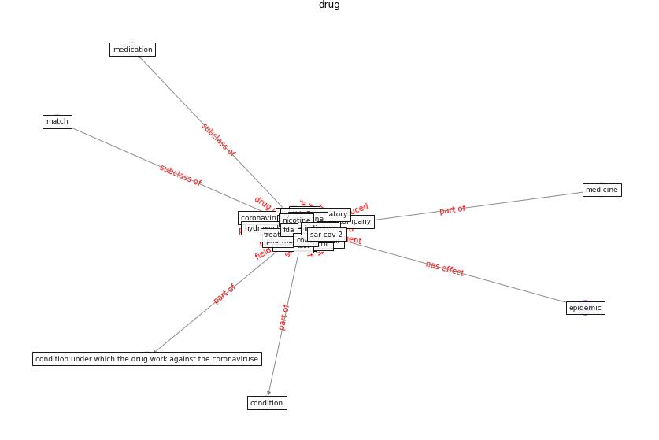

# Keyword: __drug__
## Clusters

* Cluster 5: [ontology-datum](cluster_5)
* Cluster 15: [water-wastewater](cluster_15)

## Concepts

 

## Top 10 articles for __drug__
* CIDO, a community-based ontology for coronavirus disease
knowledge and data integration, sharing, and analysis ([he_cido_2020](article_he_cido_2020))
* Future perspectives of wastewater-based epidemiology:
Monitoring infectious disease spread and resistance to
the community level ([sims_future_2020](article_sims_future_2020))
* A Comprehensive Review of the COVID-19 Pandemic
and the Role of IoT, Drones, AI, Blockchain, and
5G in Managing its Impact ([chamola_comprehensive_2020](article_chamola_comprehensive_2020))
* Construction of a Linked Data Set of COVID-19
Knowledge Graphs: Development and Applications ([wang_construction_2022](article_wang_construction_2022))
* Graphene-based nanomaterials as antimicrobial surface
coatings: A parallel approach to restrain the expansion
of COVID-19 ([ayub_graphene-based_2021](article_ayub_graphene-based_2021))
* How the 5G Enabled the COVID-19 Pandemic
Prevention and Control: Materiality, Affordance,
and (De-)Spatialization ([li_how_2022](article_li_how_2022))
* Design COVID-19 Ontology: A Healthcare and
Safety Perspective ([aloulou_design_2022](article_aloulou_design_2022))
* Current knowledge of COVID-19: Advances, challenges
and future perspectives ([wu_current_2021](article_wu_current_2021))
* Response to COVID-19 in Taiwan: Big Data
Analytics, New Technology, and Proactive
Testing ([wang_response_2020](article_wang_response_2020))
* Impacts of COVID-19 on Health and Safety of
Workforce in Construction Industry ([pamidimukkala_impacts_2021](article_pamidimukkala_impacts_2021))
