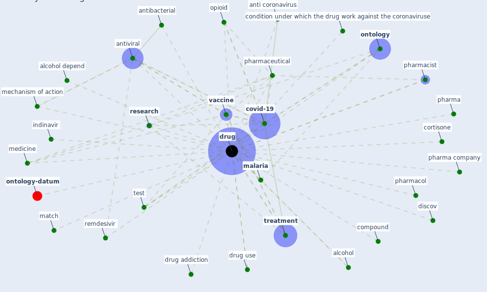

# Keyword: drug

* [wastewater-water](cluster_0)

## Keywords

 * Cluster_0, alcohol, alcohol depend, alleviate symptom, anti coronavirus, anti coronavirus drug, anti inflammatory, antibacterial, [antiviral](keyword_antiviral), arbidol, arthritis, cocaine, compound, condition, condition under which the drug work against the coronaviruse, cortisone, [covid-19](keyword_covid-19), development of effective drug, discov, [disease](keyword_disease), [drug](keyword_drug), drug addiction, drug development, drug target interaction, drug use, drugs, [epidemic](keyword_epidemic), fda, [healthcare](keyword_healthcare), hydroxychloroquine, illicit, indinavir, ivermectin, ivermectin inhibit the replication of sar cov 2 in vitro, [malaria](keyword_malaria), match, mechanism of action, medication, medicine, nicotine, [nih](keyword_nih), nonpharmaceutical, [ontology](keyword_ontology), opioid, pharma, pharma company, pharmaceutical, pharmacist, pharmacol, remdesivir, [research](keyword_research), resistance, [sar cov 2](keyword_sar_cov_2), [test](keyword_test), [treatment](keyword_treatment), [vaccine](keyword_vaccine)

## Mapping

## Neighbours

### Closest articles

* CIDO, a community-based ontology for coronavirus disease knowledge and data integration, sharing, and analysis - [LINK](article_he_cido_2020)
* Future perspectives of wastewater-based epidemiology: Monitoring infectious disease spread and resistance to the community level - [LINK](article_sims_future_2020)
* A Comprehensive Review of the COVID-19 Pandemic and the Role of IoT, Drones, AI, Blockchain, and 5G in Managing its Impact - [LINK](article_chamola_comprehensive_2020)
* Construction of a Linked Data Set of COVID-19 Knowledge Graphs: Development and Applications - [LINK](article_wang_construction_2022)
* Nurture to nature via COVID-19, a self-regenerating environmental strategy of environment in global context - [LINK](article_paital_nurture_2020)
* Design COVID-19 Ontology: A Healthcare and Safety Perspective - [LINK](article_aloulou_design_2022)
* How the 5G Enabled the COVID-19 Pandemic Prevention and Control: Materiality, Affordance, and (De-)Spatialization - [LINK](article_li_how_2022)
* Current knowledge of COVID-19: Advances, challenges and future perspectives - [LINK](article_wu_current_2021)
* Graphene-based nanomaterials as antimicrobial surface coatings: A parallel approach to restrain the expansion of COVID-19 - [LINK](article_ayub_graphene-based_2021)
* Response to COVID-19 in Taiwan - [LINK](article_wang_response_2020)

### Closest BPs

