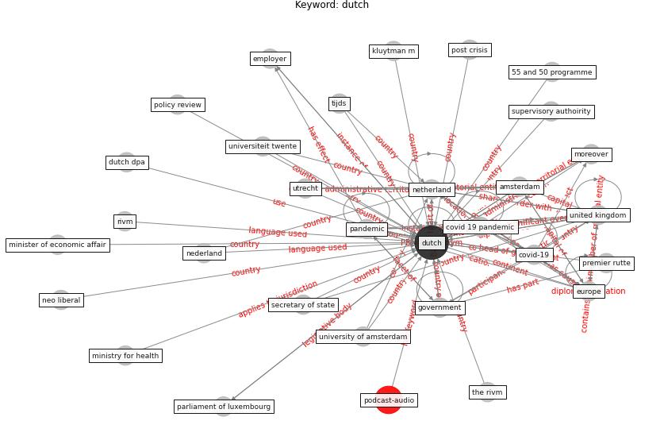

# Keyword: dutch

* [podcast-audio](cluster_Cluster_7)

## Keywords

 * 55 and 50 programme, Cluster_7, alleen, alleen saman krijgen, alleen saman krijgen we corona onder controle, amsterdam, anderhalvemetersamenleve, belgian, build code, covid 19 measure, [covid 19 pandemic](keyword_covid_19_pandemic), [covid-19](keyword_covid-19), data protection authority, [dutch](keyword_dutch), dutch dpa, dutch hospital, dutch ministry for health, [employer](keyword_employer), [europe](keyword_europe), [government](keyword_government), health ministry, health questionnaire, intelligent lockdown, kluytman m, [lockdown](keyword_lockdown), minister of economic affair, ministry for health, moreover, nederland, neo liberal, [netherland](keyword_netherland), [pandemic](keyword_pandemic), parliament of luxembourg, policy review, post crisis, premier rutte, rivm, secretary of state, supervisory authoirity, the rivm, tijds, [united kingdom](keyword_united_kingdom), universiteit twente, university of amsterdam, utrecht, [wastewater](keyword_wastewater)

## Concepts

 

## Neighbours

### Closest articles

* 2020 Data Protection Report - [LINK](article_council_of_europe_2020_2020)
* The Intelligent Lockdown: Compliance with COVID-19 Mitigation Measures in the Netherlands - [LINK](article_kuiper_intelligent_2020)
* Sustainable work throughout the life course: National policies and strategies, Publications Office of the European Union - [LINK](article_eurofund_sustainable_2016)
* The COVID-19 pandemic: Impacts on cities and major lessons for urban planning, design, and management - [LINK](article_sharifi_covid-19_2020)
* How the Coronavirus Will Reshape Architecture - [LINK](article_chayka_how_2020)
* Public housing and COVID-19: contestation, challenge and change - [LINK](article_power_public_2020)
* Mobility Behaviour in View of the Impact of the COVID-19 Pandemic—Public Transport Users in Gdansk Case Study - [LINK](article_przybylowski_mobility_2021)
* COVID-19 and the UN Sustainable Development Goals: Threat to Solidarity or an Opportunity? - [LINK](article_leal_filho_covid-19_2020)
* Presence of SARS-Coronavirus-2 RNA in Sewage and Correlation with Reported COVID-19 Prevalence in the Early Stage of the Epidemic in The Netherlands - [LINK](article_medema_presence_2020)
* A review of facilities management interventions to mitigate respiratory infections in existing buildings - [LINK](article_zhang_review_2022)

### Closest BPs

