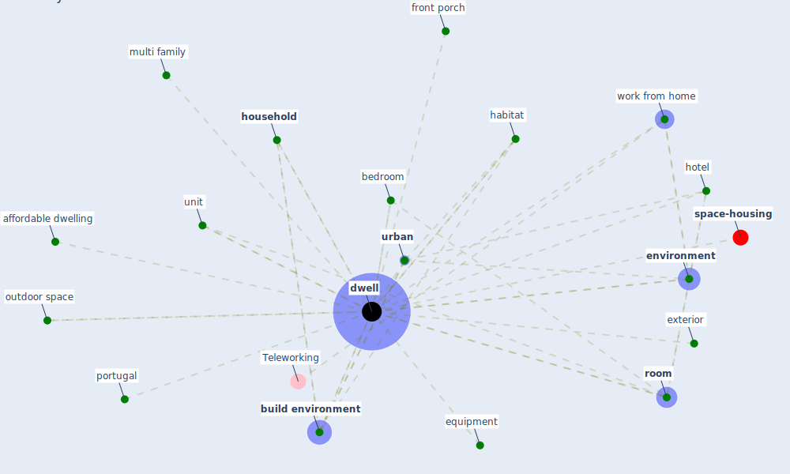

# Keyword: dwell

* [space-housing](cluster_4)

## Keywords

 * Cluster_4, affordable dwelling, [bedroom](keyword_bedroom), [build environment](keyword_build_environment), [dwell](keyword_dwell), dwelling, [environment](keyword_environment), equipment, exterior, front porch, habitat, hotel, [household](keyword_household), multi family, outdoor space, [portugal](keyword_portugal), [room](keyword_room), unit, [urban](keyword_urban), work from home

## Mapping

## Neighbours

### Closest articles

* A Mixed Approach on Resilience of Spanish Dwellings and Households during COVID-19 Lockdown - [LINK](article_cuerdo-vilches_mixed_2020)
* Biophilic design in architecture and its contributions to health, well-being, and sustainability: A critical review - [LINK](article_zhong_biophilic_2022)
* The role of green roofs in post COVID-19 confinement: An analysis of willingness to pay - [LINK](article_manso_role_2021)
* How our homes impact our health: using a COVID-19 informed approach to examine urban apartment housing - [LINK](article_peters_how_2020)
* Designing for COVID-2x: Reflecting on Future-Proofing Human Habitation for the Inevitable Next Pandemic - [LINK](article_spennemann_designing_2022)
* COVID-19 and the rise of intimate partner violence - [LINK](article_aguero_covid-19_2021)
* Attitudes towards outdoor and neighbour noise during the COVID-19 lockdown: A case study in London - [LINK](article_lee_attitudes_2021)
* Urban design attributes and resilience: COVID-19 evidence from New York City - [LINK](article_yang_urban_2021)

### Closest BPs

