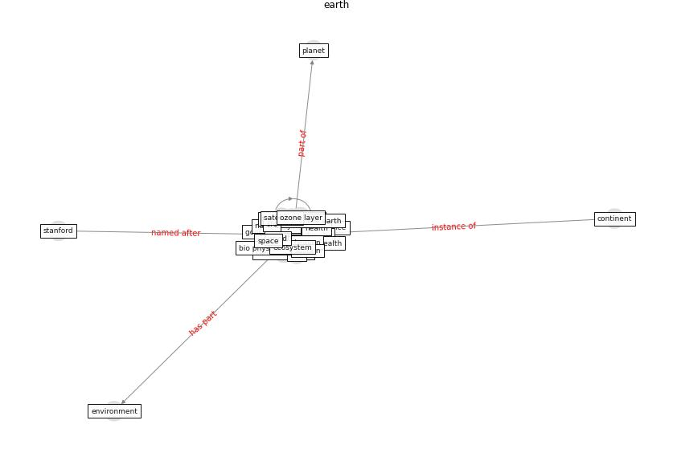

# Keyword: __earth__
## Clusters

* Cluster 7: [climate-change](cluster_7)

## Concepts

 

## Articles
* Analysis of COVID-19 Concerns Raised by the
Construction Workforce and Development of
Mitigation Practices ([bou_hatoum_analysis_2021](article_bou_hatoum_analysis_2021))
* Influence between COVID-19 Impacts and Project
Stakeholders in Chilean Construction Projects ([araya_influence_2021](article_araya_influence_2021))
* Mechanisms for addressing the impact of COVID-19 on
infrastructure projects ([king_mechanisms_2021](article_king_mechanisms_2021))
* Revisiting the built environment: 10 potential development
changes and paradigm shifts due to COVID-19 ([cheshmehzangi_revisiting_2021](article_cheshmehzangi_revisiting_2021))
* Housing Experience in Gated Communities in the
Time of Pandemics: Lessons Learned from
COVID-19 ([asfour_housing_2022](article_asfour_housing_2022))
* nassereddine_propositions_2021 ([nassereddine_propositions_2021](article_nassereddine_propositions_2021))
* Navigating Climate Change: Rethinking the Role of
Buildings ([cole_navigating_2020](article_cole_navigating_2020))
* The Socio-Spatial Determinants of COVID-19
Diffusion: The Impact of Globalisation,
Settlement Characteristics and Population ([sigler_socio-spatial_2020](article_sigler_socio-spatial_2020))
* harvard_th_chan_schoold_of_public_health_coronavirus_2020 ([harvard_th_chan_schoold_of_public_health_coronavirus_2020](article_harvard_th_chan_schoold_of_public_health_coronavirus_2020))
* martin_impact_2008 ([martin_impact_2008](article_martin_impact_2008))
