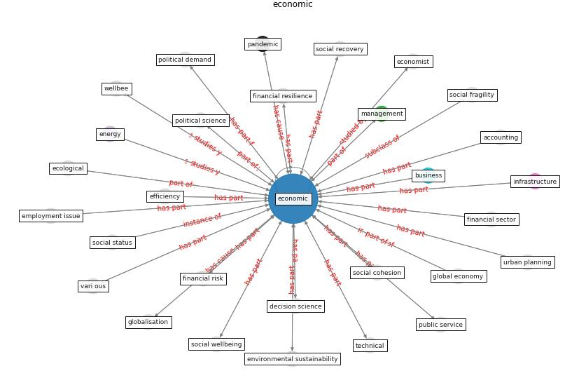

# Keyword: __economic__
## Clusters

* Cluster 4: [resilience-health](cluster_4)

## Concepts

 

## Top 10 articles for __economic__
* world_bank_world_2022 ([world_bank_world_2022](article_world_bank_world_2022))
* How COVID-19 Could Accelerate the Adoption of
New Retail Technologies and Enhance the
(E-)Servicescape ([willems_how_2021](article_willems_how_2021))
* A critical analysis of the impacts of COVID-19 on the
global economy and ecosystems and opportunities for
circular economy strategies ([ibn-mohammed_critical_2021](article_ibn-mohammed_critical_2021))
* realdania_refleksioner_2022_EN ([realdania_refleksioner_2022_EN](article_realdania_refleksioner_2022_EN))
* rtpi_urban_2021 ([rtpi_urban_2021](article_rtpi_urban_2021))
* Mapping research in logistics and supply chain management
during COVID-19 pandemic ([montoya-torres_mapping_2021](article_montoya-torres_mapping_2021))
* Health, Economic and Social Development Challenges
of the COVID-19 Pandemic: Strategies for Multiple
and Interconnected Issues ([panneer_health_2022](article_panneer_health_2022))
* Assessment of Building Automation and Control
Systems in Danish Healthcare Facilities in the
COVID-19 Era ([pedersen_assessment_2022](article_pedersen_assessment_2022))
* Learning from pandemics: Applying resilience thinking to
identify priorities for planning urban settlements ([syal_learning_2021](article_syal_learning_2021))
* The socio-economic determinants of COVID-19: A spatial
analysis of German county level data ([ehlert_socio-economic_2021](article_ehlert_socio-economic_2021))
