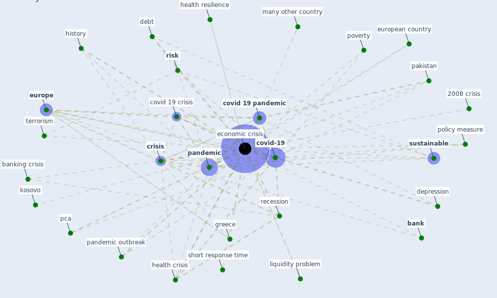

# Keyword: economic crisis

## Keywords

 * 2008 crisis, [bank](keyword_bank), bank during an economic crisis, banking crisis, change in labour market and employment system, [construction](keyword_construction), [covid 19 crisis](keyword_covid_19_crisis), [covid 19 pandemic](keyword_covid_19_pandemic), covid economic crisis, [covid-19](keyword_covid-19), [crisis](keyword_crisis), debt, [depression](keyword_depression), economic crises, [economic crisis](keyword_economic_crisis), economic growth, economically important sector and firm, [europe](keyword_europe), european, european country, g20, great britain, greece, [health](keyword_health), health and economic crisis, health crisis, health resilience, health system resilience, history, [india](keyword_india), insolvent, ireland, kosovo, labour demand, liquidity problem, many other country, pakistan, [pandemic](keyword_pandemic), pandemic outbreak, pca, policy measure, poverty, recession, [risk](keyword_risk), short response time, [sustainable](keyword_sustainable), terrorism, the pandemic, unemployment

## Mapping

## Neighbours

### Closest articles

* World Bank Development Report - [LINK](article_world_bank_world_2022)
* COVID-19: IMPACT OF THE PANDEMIC ON THE SUSTAINABLE DEVELOPMENT GOALS - [LINK](article_samout_covid-19_2020)
* Building sustainable finance for resilient protected and conserved areas: lessons from COVID-19 - [LINK](article_cumming_building_2021)
* Health, Economic and Social Development Challenges of the COVID-19 Pandemic: Strategies for Multiple and Interconnected Issues - [LINK](article_panneer_health_2022)
* How COVID-19 Could Accelerate the Adoption of New Retail Technologies and Enhance the (E-)Servicescape - [LINK](article_willems_how_2021)
* The socio-economic implications of the coronavirus pandemic (COVID-19): A review - [LINK](article_nicola_socio-economic_2020)
* Sustainable work throughout the life course: National policies and strategies, Publications Office of the European Union - [LINK](article_eurofund_sustainable_2016)
* Strengthening resilience: a priority shared by Health 2020 and - [LINK](article_who_strengthening_2017)
* Startups in times of crisis – A rapid response to the COVID-19 pandemic - [LINK](article_kuckertz_startups_2020)
* Propositions for a Resilient, Post-COVID-19 Future for the AEC Industry - [LINK](article_nassereddine_propositions_2021)

### Closest BPs

