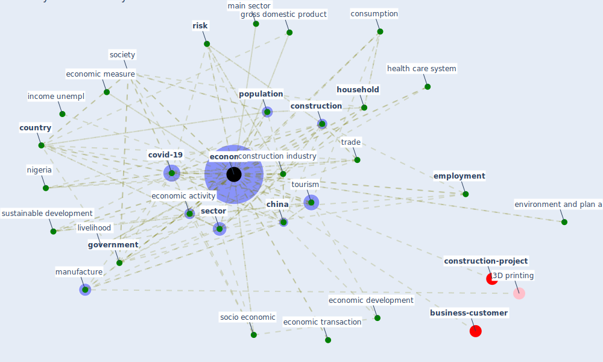

# Keyword: economy

* [construction-project](cluster_8)

* [business-customer](cluster_11)

## Keywords

 * [bank](keyword_bank), business economy, business regulation, [china](keyword_china), chinese firm, [circular economy](keyword_circular_economy), climate adaptation, coal, [community](keyword_community), [construction](keyword_construction), [construction industry](keyword_construction_industry), consumption, core sustain pillar, [country](keyword_country), [covid-19](keyword_covid-19), [crisis](keyword_crisis), culture, [denmark](keyword_denmark), develop, downturn, economic activity, economic development, economic growth, economic hubs, economic measure, economic sector, economic transaction, [economy](keyword_economy), emerge economy, emerge market, [employment](keyword_employment), environment and plan a, [firm](keyword_firm), fourth quarter, [germany](keyword_germany), [globalisation](keyword_globalisation), good, [government](keyword_government), gross domestic product, [health](keyword_health), health care system, [healthcare](keyword_healthcare), [household](keyword_household), imf, income unempl, [india](keyword_india), information society, [infrastructure](keyword_infrastructure), interconnect, isolation, [job](keyword_job), job destruction, knowledge economy, [labour market](keyword_labour_market), [level](keyword_level), [live](keyword_live), livelihood, main sector, [manufacture](keyword_manufacture), middle income, nation, nation s, [nature](keyword_nature), negative feedback, [nigeria](keyword_nigeria), oil, overall economy, [pandemic](keyword_pandemic), [people](keyword_people), [plan](keyword_plan), [policy](keyword_policy), politic, [population](keyword_population), post crisis, pre covid level, privatisation, reform, resilient, responsible economy, [risk](keyword_risk), [sector](keyword_sector), [service](keyword_service), significant shock, singapore, [social](keyword_social), [society](keyword_society), socio economic, [space](keyword_space), [spillover effect](keyword_spillover_effect), [supply chain](keyword_supply_chain), [sustainable development](keyword_sustainable_development), the pandemic, the uk, [tourism](keyword_tourism), trade, turkish, [united kingdom](keyword_united_kingdom), [urban](keyword_urban), urban economy, ôte d ivoire

## Mapping

## Neighbours

### Closest articles

* World Bank Development Report - [LINK](article_world_bank_world_2022)
* Mechanisms for addressing the impact of COVID-19 on infrastructure projects - [LINK](article_king_mechanisms_2021)
* Urban planning after COVID-19 - [LINK](article_rtpi_urban_2021)
* COVID-19: IMPACT OF THE PANDEMIC ON THE SUSTAINABLE DEVELOPMENT GOALS - [LINK](article_samout_covid-19_2020)
* A critical analysis of the impacts of COVID-19 on the global economy and ecosystems and opportunities for circular economy strategies - [LINK](article_ibn-mohammed_critical_2021)
* How COVID-19 Could Accelerate the Adoption of New Retail Technologies and Enhance the (E-)Servicescape - [LINK](article_willems_how_2021)
* Strategies to Mitigate COVID-19 Pandemic Impacts on Health and Safety of Workers in Construction Projects - [LINK](article_kaushal_strategies_2021)
* COVID-ABS: An agent-based model of COVID-19 epidemic to simulate health and economic effects of social distancing interventions - [LINK](article_silva_covid-abs_2020)
* COVID-19 risks and systemic gaps in Nigeria: resilience building lessons for pandemic and climate change management - [LINK](article_lawal_covid-19_2022)
* Guidelines for Responding to COVID-19 Pandemic: Best Practices, Impacts, and Future Research Directions - [LINK](article_assaad_guidelines_2021)

### Closest BPs

