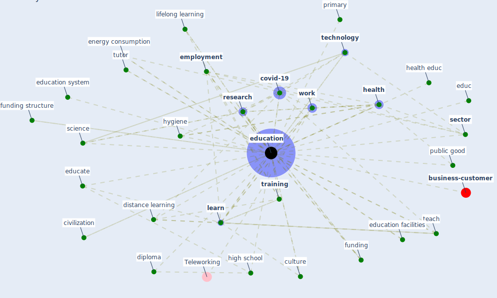

# Keyword: education

* [business-customer](cluster_11)

## Keywords

 * Cluster_11, [architect](keyword_architect), awareness, bachelor s degree, [care](keyword_care), civilization, communication, [computer](keyword_computer), [covid-19](keyword_covid-19), culture, diploma, distance learning, economic activity, educ, educate, [education](keyword_education), education facilities, education level, education system, educative, [employment](keyword_employment), [energy consumption](keyword_energy_consumption), entertainment, european country, [facility](keyword_facility), funding, funding structure, graduation phase, group communication, hand hygiene, [health](keyword_health), health educ, [healthcare](keyword_healthcare), high school, hygiene, in person lesson, income, [infrastructure](keyword_infrastructure), [innovation](keyword_innovation), intervention strategy, job design, [knowledge](keyword_knowledge), knowledge gap, [learn](keyword_learn), learn system, lifelong learning, multi teaching, noise affect learn, online education, patient education, pedagogy, perception of the information receive about the pandemic, phd, poverty, [practice](keyword_practice), preparedness, prevent climate change, [prevention](keyword_prevention), primary, primary education, primary school, promote educ, public good, public service, [quality](keyword_quality), remote learning, [research](keyword_research), [resilience](keyword_resilience), [safety](keyword_safety), [school](keyword_school), science, scottish council, sdg 4, secondary, [sector](keyword_sector), self management, set, [social](keyword_social), support to learn, [surgical](keyword_surgical), teach, [technology](keyword_technology), tertiary, tertiary education, tertiary level, the area, [training](keyword_training), training and education, tutor, [tvet](keyword_tvet), undergraduate, [variable](keyword_variable), [work](keyword_work), [work base learn](keyword_work_base_learn), work educ, work experience, work skill, [worker](keyword_worker), worker education, youth

## Mapping

## Neighbours

### Closest articles

* Case Study on Finnish TVETA Resilient Model of Training During COVID-19 - [LINK](article_unesco_case_2021)
* Sustainable work throughout the life course: National policies and strategies, Publications Office of the European Union - [LINK](article_eurofund_sustainable_2016)
* Management of the COVID-19 pandemic: challenges, practices, and organizational support - [LINK](article_hossny_management_2022)
* Health, Economic and Social Development Challenges of the COVID-19 Pandemic: Strategies for Multiple and Interconnected Issues - [LINK](article_panneer_health_2022)
* World Bank Development Report - [LINK](article_world_bank_world_2022)
* How COVID-19 Could Accelerate the Adoption of New Retail Technologies and Enhance the (E-)Servicescape - [LINK](article_willems_how_2021)
* Designing for COVID-2x: Reflecting on Future-Proofing Human Habitation for the Inevitable Next Pandemic - [LINK](article_spennemann_designing_2022)
* The Effects of Pandemic on Construction Industry in the UK - [LINK](article_shibani_effects_2020)
* COVID-19 Prevention and Control Measures in Workplace Settings: A Rapid Review and Meta-Analysis - [LINK](article_ingram_covid-19_2021)
* A Mixed Approach on Resilience of Spanish Dwellings and Households during COVID-19 Lockdown - [LINK](article_cuerdo-vilches_mixed_2020)

### Closest BPs

