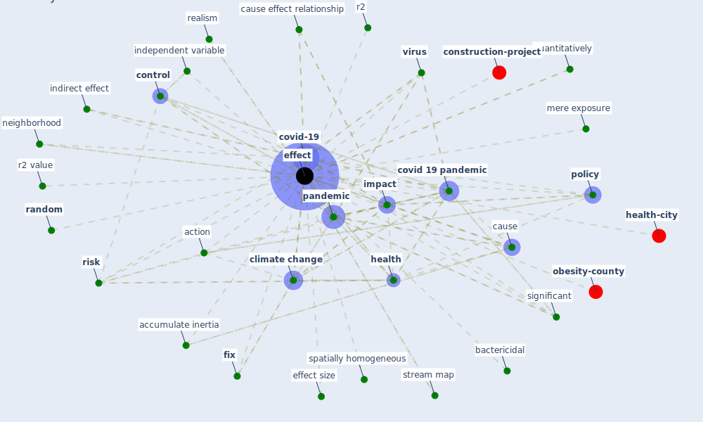

# Keyword: effect

* [health-city](cluster_1)

* [construction-project](cluster_8)

* [obesity-county](cluster_9)

## Keywords

 * Cluster_1, Cluster_8, Cluster_9, accumulate inertia, action, age, bactericidal, carbon emission, cause, cause effect relationship, [climate change](keyword_climate_change), coefficient of distance, complexity, [control](keyword_control), cope, [covid 19 crisis](keyword_covid_19_crisis), [covid 19 pandemic](keyword_covid_19_pandemic), [covid-19](keyword_covid-19), decay period, [effect](keyword_effect), effect size, effects, [fix](keyword_fix), healing, [health](keyword_health), [impact](keyword_impact), independent variable, [indirect effect](keyword_indirect_effect), intercept, intermediate il, mere exposure, month specific, month specific effect, multiplicative, [neighborhood](keyword_neighborhood), [pandemic](keyword_pandemic), [policy](keyword_policy), [public health](keyword_public_health), quantitatively, r2, r2 value, [random](keyword_random), realism, [risk](keyword_risk), significant, spatially homogeneous, [spillover effect](keyword_spillover_effect), staff turnover reduction, state specific trend, statespecific trend, stream map, trend, unintended adverse effect, variance, [virus](keyword_virus)

## Mapping

## Neighbours

### Closest articles

* Influence between COVID-19 Impacts and Project Stakeholders in Chilean Construction Projects - [LINK](article_araya_influence_2021)
* COVID-19 and the rise of intimate partner violence - [LINK](article_aguero_covid-19_2021)
* A Global Survey of Infection Control and Mitigation Measures for Combating the Transmission of COVID-19 Pandemic in Buildings Under Facilities Management Services - [LINK](article_sarvari_global_2022)
* Upper-Room Ultraviolet Light and Negative Air Ionization to Prevent Tuberculosis Transmission - [LINK](article_escombe_upper-room_2009)
* Study of COVID-19 pandemic in London (UK) from urban context - [LINK](article_ghosh_study_2020)
* Impact of Covid-19 on the built environment - [LINK](article_mahima_impact_2022)
* Occupant health in buildings: Impact of the COVID-19 pandemic on the opinions of building professionals and implications on research - [LINK](article_awada_occupant_2022)
* Designing a Multi-Agent Occupant Simulation System to Support Facility Planning and Analysis for COVID-19 - [LINK](article_lee_designing_2021)
* Green spaces, especially forest, linked to lower SARS-CoV-2 infection rates: A one-year nationwide study - [LINK](article_jiang_green_2021)
* Indirect effects of COVID-19 on the environment - [LINK](article_zambrano-monserrate_indirect_2020)

### Closest BPs

