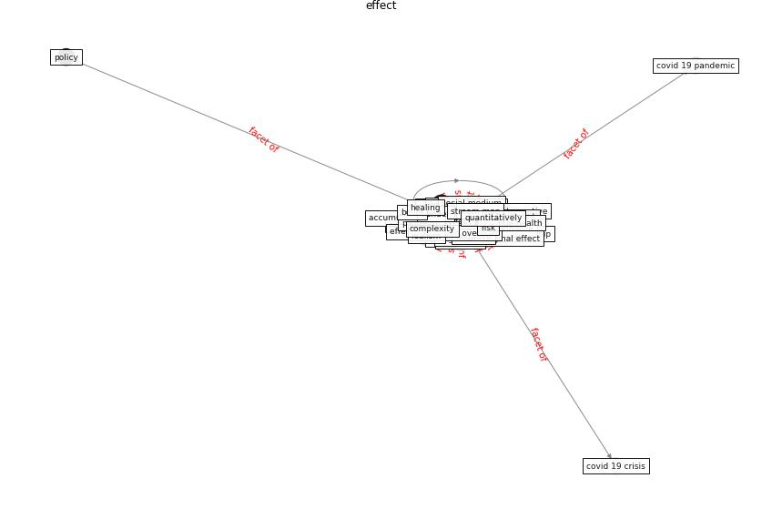

# Keyword: __effect__
## Clusters

* Cluster 15: [water-wastewater](cluster_15)

## Concepts

 

## Top 10 articles for __effect__
* Influence between COVID-19 Impacts and Project
Stakeholders in Chilean Construction Projects ([araya_influence_2021](article_araya_influence_2021))
* What drives unverified information sharing and
cyberchondria during the COVID-19 pandemic? ([laato_what_2020](article_laato_what_2020))
* A Surface Coating that Rapidly Inactivates
SARS-CoV-2 ([behzadinasab_surface_2020](article_behzadinasab_surface_2020))
* A Global Survey of Infection Control and
Mitigation Measures for Combating the Transmission
of COVID-19 Pandemic in Buildings Under
Facilities Management Services ([sarvari_global_2022](article_sarvari_global_2022))
* Upper-Room Ultraviolet Light and Negative Air
Ionization to Prevent Tuberculosis Transmission ([escombe_upper-room_2009](article_escombe_upper-room_2009))
* Occupant health in buildings: Impact of the COVID-19
pandemic on the opinions of building professionals and
implications on research ([awada_occupant_2022](article_awada_occupant_2022))
* Designing Post COVID-19 Buildings: Approaches for
Achieving Healthy Buildings ([navaratnam_designing_2022](article_navaratnam_designing_2022))
* Association of built environment attributes with the
spread of COVID-19 at its initial stage in China ([li_association_2021](article_li_association_2021))
* A Global Survey of Infection Control and
Mitigation Measures for Combating the Transmission
of COVID-19 Pandemic in Buildings Under
Facilities Management Services ([sarvari_global_2022](article_sarvari_global_2022))
* Designing a Multi-Agent Occupant Simulation
System to Support Facility Planning and Analysis
for COVID-19 ([lee_designing_2021](article_lee_designing_2021))
