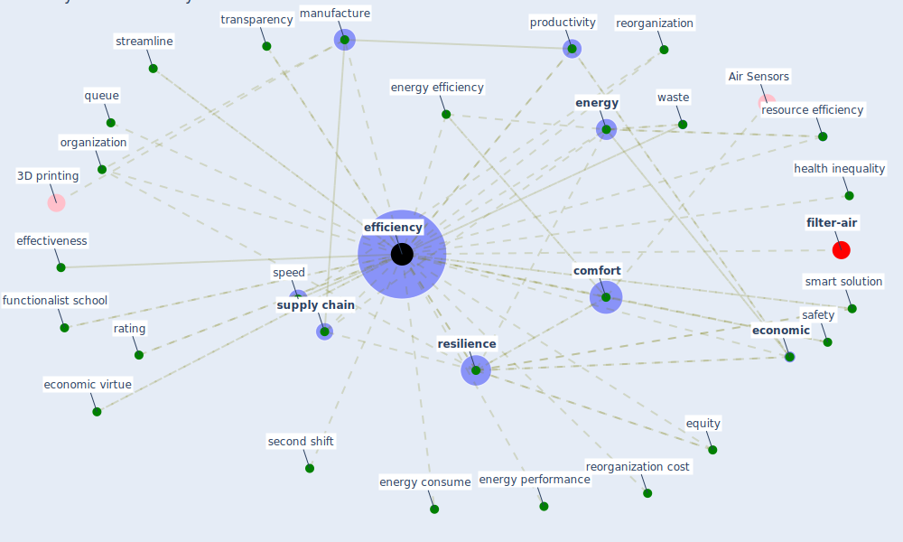

# Keyword: efficiency

* [filter-air](cluster_0)

## Keywords

 * Cluster_0, [clean](keyword_clean), cleaning frequency, co benefit, [comfort](keyword_comfort), convenience, cost effective, [economic](keyword_economic), economic virtue, effectiveness, efficiencies, [efficiency](keyword_efficiency), efficiency cost, [energy](keyword_energy), energy consume, [energy efficiency](keyword_energy_efficiency), energy performance, environmental, equity, [expert system](keyword_expert_system), frequency, functionalist school, health inequality, high price, high price of efficiency, impact criterion, learn, [management](keyword_management), [manufacture](keyword_manufacture), minimum efficiency reporting value, organization, phase, price, [productivity](keyword_productivity), qa, queue, rating, reorganization, reorganization cost, [resilience](keyword_resilience), resource efficiency, [safety](keyword_safety), second shift, smart solution, speed, streamline, [supply chain](keyword_supply_chain), tax administration, transparency, waste, wasteful

## Mapping

## Neighbours

### Closest articles

* COVID-19 as a Harbinger of Transforming Infrastructure Resilience - [LINK](article_carvalhaes_covid-19_2020)
* World Bank Development Report - [LINK](article_world_bank_world_2022)
* Readiness Assessment of Green Building Certification Systems for Residential Buildings during Pandemics - [LINK](article_tleuken_readiness_2021)
* How COVID-19 Could Accelerate the Adoption of New Retail Technologies and Enhance the (E-)Servicescape - [LINK](article_willems_how_2021)
* Assessment of Building Automation and Control Systems in Danish Healthcare Facilities in the COVID-19 Era - [LINK](article_pedersen_assessment_2022)
* Digital Twin of COVID-19 Mass Vaccination Centers - [LINK](article_pilati_digital_2021)
* Ventilation use in nonmedical settings during COVID-19: Cleaning protocol, maintenance, and recommendations - [LINK](article_nembhard_ventilation_2020)
* A review of facilities management interventions to mitigate respiratory infections in existing buildings - [LINK](article_zhang_review_2022)
* Contributions of Smart City Solutions and Technologies to Resilience against the COVID-19 Pandemic: A Literature Review - [LINK](article_sharifi_contributions_2021)
* DeepSOCIAL: Social Distancing Monitoring and Infection Risk Assessment in COVID-19 Pandemic - [LINK](article_rezaei_deepsocial_2020)

### Closest BPs

