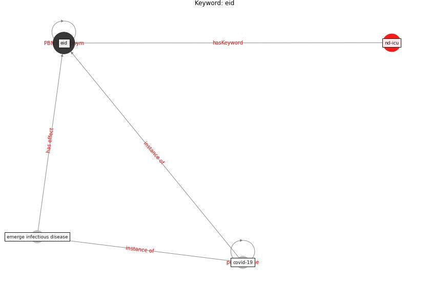

# Keyword: eid

* [nd-icu](cluster_Cluster_0)

## Keywords

 * Cluster_0, [covid-19](keyword_covid-19), [eid](keyword_eid), emerge infectious disease

## Concepts

 

## Neighbours

### Closest articles

* Aerosol and Surface Distribution of Severe Acute Respiratory Syndrome Coronavirus 2 in Hospital Wards, Wuhan, China, 2020 - [LINK](article_guo_aerosol_2020)
* How loneliness is talked about in social media during COVID-19 pandemic: Text mining of 4,492 Twitter feeds - [LINK](article_koh_how_2022)

### Closest BPs

