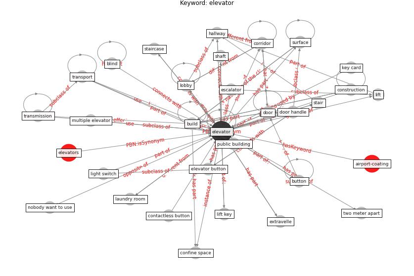

# Keyword: elevator

* [airport-coating](cluster_Cluster_6)

## Keywords

 * Cluster_6, air duct, blind, [build](keyword_build), [building](keyword_building), button, canteen, classroom, common area, confine space, [construction](keyword_construction), construction company, contactless button, contactless technology, [corridor](keyword_corridor), door, door handle, door locker, [doorknob](keyword_doorknob), egress management, [elevator](keyword_elevator), elevator button, elevator wait area, elevator waiting area, elevators, entrance, escalator, extravelle, fast move, foot activate call button, hallway, hand free system, high rise building, ingress and egress point, inter storey communication and transport, key card, key card access, laundry room, lift, lift key, light switch, lobby, multiple elevator, nobody want to use, nobody want to use elevator, office space, public building, shaft, stair, staircase, stairwell, stand by plug, steel frame, [surface](keyword_surface), [transmission](keyword_transmission), [transport](keyword_transport), two meter, two meter apart, voice activate

## Concepts

 

## Neighbours

### Closest articles

* Prophylactic Architecture: Formulating the Concept of Pandemic-Resilient Homes - [LINK](article_elrayies_prophylactic_2022)
* Designing for COVID-2x: Reflecting on Future-Proofing Human Habitation for the Inevitable Next Pandemic - [LINK](article_spennemann_designing_2022)
* COVID-19 Experience Transforming the Protective Environment of Office Buildings and Spaces - [LINK](article_phapant_covid-19_2021)
* RESIDENTIAL ARCHITECTURE IN A POST-PANDEMIC WORLD: IMPLICATIONS OF COVID-19 FOR NEW CONSTRUCTION AND FOR ADAPTING HERITAGE BUILDINGS - [LINK](article_spennemann_residential_2021)
* Management of the COVID-19 pandemic: challenges, practices, and organizational support - [LINK](article_hossny_management_2022)
* How our homes impact our health: using a COVID-19 informed approach to examine urban apartment housing - [LINK](article_peters_how_2020)
* Designing Post COVID-19 Buildings: Approaches for Achieving Healthy Buildings - [LINK](article_navaratnam_designing_2022)
* Antivirus-built environment: Lessons learned from Covid-19 pandemic - [LINK](article_megahed_antivirus-built_2020)
* The Effects of Pandemic on Construction Industry in the UK - [LINK](article_shibani_effects_2020)
* Towards Resilient Residential Buildings and Neighborhoods in Light of COVID-19 Pandemic—The Scenario of Podgorica, Montenegro - [LINK](article_bojovic_towards_2022)

### Closest BPs

