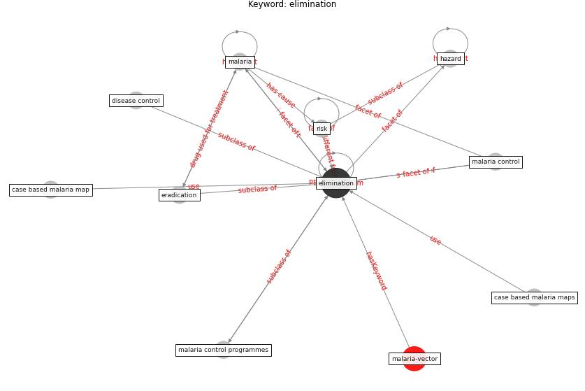

# Keyword: elimination

* [malaria-vector](cluster_Cluster_12)

## Keywords

 * Cluster_12, case based malaria map, case based malaria maps, disease control, [elimination](keyword_elimination), eradication, hazard, [malaria](keyword_malaria), malaria control, malaria control programmes, [risk](keyword_risk)

## Concepts

 

## Neighbours

### Closest articles

* Integrating rapid risk mapping and mobile phone call record data for strategic malaria elimination planning - [LINK](article_tatem_integrating_2014)
* Addressing vulnerability, building resilience: community-based adaptation to vector-borne diseases in the context of global change - [LINK](article_bardosh_addressing_2017)
* Decision Making within the Built Environment as a Strategy for Mitigating the Risk of Malaria and Other Vector-Borne Diseases - [LINK](article_obonyo_decision_2018)
* How will COVID-19 change future building regulations? - [LINK](article_hmc_architects_how_2020)
* The Role of Architecture and Urbanism in Preventing Pandemics - [LINK](article_kumar_role_2021)
* Challenges to Mitigating the Urban Health Burden of Mosquito-Borne Diseases in the Face of Climate Change - [LINK](article_ligsay_challenges_2021)
* COVID-19 Experience Transforming the Protective Environment of Office Buildings and Spaces - [LINK](article_phapant_covid-19_2021)

### Closest BPs

