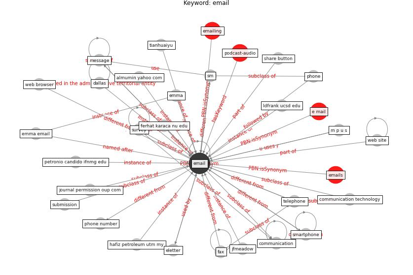

# Keyword: email

* [podcast-audio](cluster_Cluster_7)

## Keywords

 * Cluster_7, almumin yahoo com, biswaranjanpaital, communication, communication technology, conference call, [dallas](keyword_dallas), direct, direct email, dsid8495 uni sydney edu, dsid8495 uni sydney edu au, e mail, e mail address, eletter, [email](keyword_email), emailing, emails, emma, emma email, fax, ferhat karaca nu edu, hafiz petroleum utm my, jfmeadow, journal permission oup com, ldfrank ucsd edu, m p u s, message, petronio candido ifnmg edu, phone, phone number, share button, sm, smartphone, submission, survey, telephone, tianhuaiyu, web browser, web site, weijiezhong72

## Concepts

 

## Neighbours

### Closest articles

* A Global Survey of Infection Control and Mitigation Measures for Combating the Transmission of COVID-19 Pandemic in Buildings Under Facilities Management Services - [LINK](article_sarvari_global_2022)
* The City Under COVID‐19: Podcasting As Digital Methodology - [LINK](article_rogers_city_2020)
* A comprehensive review on indoor air quality monitoring systems for enhanced public health - [LINK](article_saini_comprehensive_2020)
* The effect of human mobility and control measures on the COVID-19 epidemic in China - [LINK](article_kraemer_effect_2020)
* Association between indoor-outdoor green features and psychological health during the COVID-19 lockdown in Italy: A cross-sectional nationwide study - [LINK](article_spano_association_2021)
* Combating COVID-19—The role of robotics in managing public health and infectious diseases - [LINK](article_yang_combating_2020)
* Analysis of COVID-19 Concerns Raised by the Construction Workforce and Development of Mitigation Practices - [LINK](article_bou_hatoum_analysis_2021)
* Management of the COVID-19 pandemic: challenges, practices, and organizational support - [LINK](article_hossny_management_2022)
* Contributions of Smart City Solutions and Technologies to Resilience against the COVID-19 Pandemic: A Literature Review - [LINK](article_sharifi_contributions_2021)
* Assessment of COVID-19 precautionary measures in sports facilities: A case study on a health club in Saudi Arabia - [LINK](article_ibrahim_assessment_2022)

### Closest BPs

