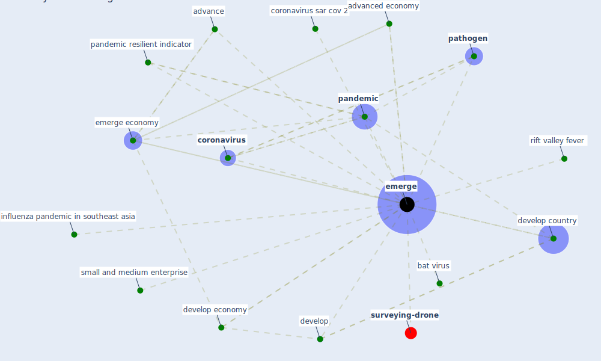

# Keyword: emerge

* [surveying-drone](cluster_13)

## Keywords

 * Cluster_13, advance, advanced economy, bat virus, [coronavirus](keyword_coronavirus), coronavirus sar cov 2, develop, develop country, develop economy, [emerge](keyword_emerge), emerge economy, emerging, influenza pandemic in southeast asia, [pandemic](keyword_pandemic), [pandemic resilient indicator](keyword_pandemic_resilient_indicator), [pathogen](keyword_pathogen), [rift valley fever](keyword_rift_valley_fever), small and medium enterprise

## Mapping

## Neighbours

### Closest articles

* World Bank Development Report - [LINK](article_world_bank_world_2022)
* COVID-19 and regional solutions for mitigating the risk of SME finance in selected ASEAN member states - [LINK](article_taghizadeh-hesary_covid-19_2022)
* A critical analysis of the impacts of COVID-19 on the global economy and ecosystems and opportunities for circular economy strategies - [LINK](article_ibn-mohammed_critical_2021)
* COVID-19 and a new resilient infrastructure landscape - [LINK](article_oecd_covid-19_2021)
* An Overview of Biomedical Ontologies for Pandemics and Infectious Diseases Representation - [LINK](article_bayoudhi_overview_2021)
* A critical review of heating, ventilation, and air conditioning (HVAC) systems within the context of a global SARS-CoV-2 epidemic - [LINK](article_elsaid_critical_2021)
* Future perspectives of wastewater-based epidemiology: Monitoring infectious disease spread and resistance to the community level - [LINK](article_sims_future_2020)
* Learning from pandemics: Applying resilience thinking to identify priorities for planning urban settlements - [LINK](article_syal_learning_2021)
* A Comprehensive Review of the COVID-19 Pandemic and the Role of IoT, Drones, AI, Blockchain, and 5G in Managing its Impact - [LINK](article_chamola_comprehensive_2020)

### Closest BPs

