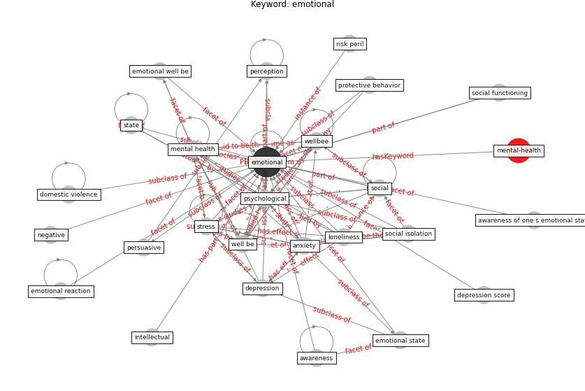

# Keyword: emotional

* [mental-health](cluster_Cluster_11)

## Keywords

 * Cluster_11, [anxiety](keyword_anxiety), awareness, awareness of one s emotional state, [depression](keyword_depression), depression score, domestic violence, [emotional](keyword_emotional), emotional reaction, emotional state, emotional well be, intellectual, [loneliness](keyword_loneliness), [mental health](keyword_mental_health), [negative](keyword_negative), perception, persuasive, [protective behavior](keyword_protective_behavior), [psychological](keyword_psychological), risk peril, [social](keyword_social), social functioning, social isolation, [state](keyword_state), [stress](keyword_stress), [well be](keyword_well_be), [wellbee](keyword_wellbee)

## Concepts

 

## Neighbours

### Closest articles

* How loneliness is talked about in social media during COVID-19 pandemic: Text mining of 4,492 Twitter feeds - [LINK](article_koh_how_2022)
* Home garden use during COVID-19: Associations with physical and mental wellbeing in older adults - [LINK](article_corley_home_2021)
* How COVID-19 Could Accelerate the Adoption of New Retail Technologies and Enhance the (E-)Servicescape - [LINK](article_willems_how_2021)
* Eviction, Health Inequity, and the Spread of COVID-19: Housing Policy as a Primary Pandemic Mitigation Strategy - [LINK](article_benfer_eviction_2021)
* The impacts of knowledge, risk perception, emotion and information on citizens’ protective behaviors during the outbreak of COVID-19: a cross-sectional study in China - [LINK](article_ning_impacts_2020)
* Retail Signage During the COVID-19 Pandemic - [LINK](article_mcneish_retail_2020)
* Mental Health and the Covid-19 Pandemic - [LINK](article_pfefferbaum_mental_2020)
* Management of the COVID-19 pandemic: challenges, practices, and organizational support - [LINK](article_hossny_management_2022)
* Antivirus-built environment: Lessons learned from Covid-19 pandemic - [LINK](article_megahed_antivirus-built_2020)
* Impacts of COVID-19 on Health and Safety of Workforce in Construction Industry - [LINK](article_pamidimukkala_impacts_2021)

### Closest BPs

