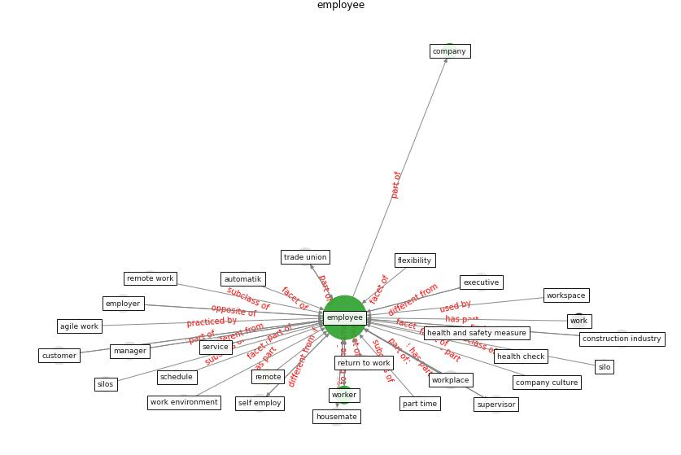

# Keyword: employee

* [construction-industry](cluster_Cluster_3)

* [space-flexible](cluster_Cluster_8)

* [customer-brand](cluster_Cluster_14)

## Keywords

 * Cluster_14, Cluster_8, agile work, amazon, automatik, behaviour, benefit, bonus, [business](keyword_business), care for the elderly, [company](keyword_company), company culture, [construction industry](keyword_construction_industry), contingency plan, [control](keyword_control), [culture](keyword_culture), [customer](keyword_customer), discussion from home, disengage, [employee](keyword_employee), employee need, employees, [employer](keyword_employer), employment, executive, face to face interaction, [facebook](keyword_facebook), fitness tracker, flexibility, frontline service, full time, gigworker, group, [health and safety](keyword_health_and_safety), health and safety measure, health and wellbeing, health check, heartist, highly qualified, homework, housemate, hr, hr department, human resource, interaction, labor, layoff, low wage, management, [manager](keyword_manager), marriott international, morale, motivation, [office](keyword_office), office administrator, part time, personality, [productivity](keyword_productivity), [remote work](keyword_remote_work), remote worker, [retail](keyword_retail), [retailer](keyword_retailer), retention, retiree, retrain, return to work, [safety](keyword_safety), schedule, self employ, senior leadership, sentiment, sentiment datum, [service](keyword_service), severance pay, shopper, silo, silos, staff turnover, [stakeholder](keyword_stakeholder), [student](keyword_student), supervisor, [survey](keyword_survey), talent, top management, trade union, training, [twitter](keyword_twitter), voluntary, wage, [well be](keyword_well_be), white collar, [work](keyword_work), work environment, work from home, work remotely, [worker](keyword_worker), [workplace](keyword_workplace), workplace safety, [workspace](keyword_workspace), young

## Concepts

 

## Neighbours

### Closest articles

* How COVID-19 Could Accelerate the Adoption of New Retail Technologies and Enhance the (E-)Servicescape - [LINK](article_willems_how_2021)
* Sustainable work throughout the life course: National policies and strategies, Publications Office of the European Union - [LINK](article_eurofund_sustainable_2016)
* It’s time to reimagine where and how work will get done (PwC’s US Remote Work Survey) - [LINK](article_pricewaterhousecoopers_its_2021)
* Health, Wellbeing \& Productivity in Offices - [LINK](article_world_green_building_council_health_2014)
* Analysis of COVID-19 Concerns Raised by the Construction Workforce and Development of Mitigation Practices - [LINK](article_bou_hatoum_analysis_2021)
* Organizations’ Management of the COVID-19 Pandemic: A Scoping Review of Business Articles - [LINK](article_boiral_organizations_2021)
* COVID-19 Experience Transforming the Protective Environment of Office Buildings and Spaces - [LINK](article_phapant_covid-19_2021)
* A study on office workplace modification during the COVID-19 pandemic in The Netherlands - [LINK](article_hou_study_2021)

### Closest BPs

