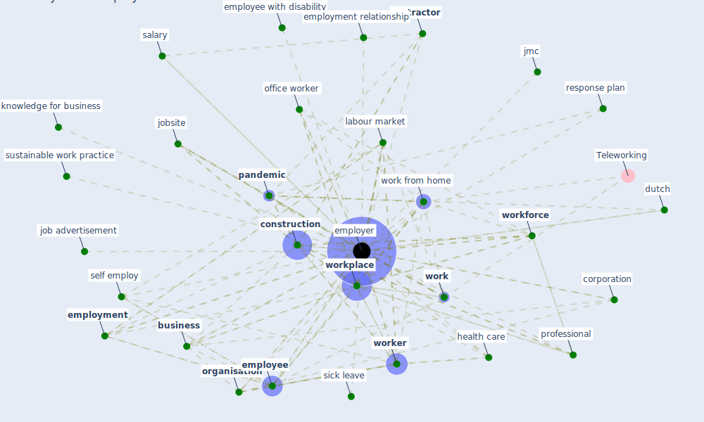

# Keyword: employer

## Keywords

 * apprenticeship, building owner, [business](keyword_business), co operative, [construction](keyword_construction), [contractor](keyword_contractor), [control](keyword_control), corporation, dismiss, dutch, education provider, employ, [employee](keyword_employee), employee with disability, [employer](keyword_employer), employer motivation, employers, [employment](keyword_employment), employment prospect, employment relationship, employment service, enterprise, fitness tracker, flexibility, german government, [germany](keyword_germany), growth, health and safety at work, health and wellbeing, [health care](keyword_health_care), health check, human resource management, jmc, job advertisement, jobsite, knowledge for business, [labour market](keyword_labour_market), [mask](keyword_mask), nation, office worker, [organisation](keyword_organisation), [pandemic](keyword_pandemic), [professional](keyword_professional), respiratory protection, response plan, salary, self employ, severance pay, sick leave, sustainable work practice, time invest by this author, trade union, value, wage determination, [work](keyword_work), work employment society, work from home, [worker](keyword_worker), worker feel about the office, [workforce](keyword_workforce), [workplace](keyword_workplace)

## Mapping

## Neighbours

### Closest articles

* Sustainable work throughout the life course: National policies and strategies, Publications Office of the European Union - [LINK](article_eurofund_sustainable_2016)
* Analysis of COVID-19 Concerns Raised by the Construction Workforce and Development of Mitigation Practices - [LINK](article_bou_hatoum_analysis_2021)
* Health, Wellbeing \& Productivity in Offices - [LINK](article_world_green_building_council_health_2014)
* It’s time to reimagine where and how work will get done (PwC’s US Remote Work Survey) - [LINK](article_pricewaterhousecoopers_its_2021)
* COVID-19 Experience Transforming the Protective Environment of Office Buildings and Spaces - [LINK](article_phapant_covid-19_2021)
* Impacts of COVID-19 on Health and Safety of Workforce in Construction Industry - [LINK](article_pamidimukkala_impacts_2021)
* A study on office workplace modification during the COVID-19 pandemic in The Netherlands - [LINK](article_hou_study_2021)
* Emerging from Lockdown: CIBSE COVID-19 Guidance - [LINK](article_cibse_emerging_2020)
* Case Study on Finnish TVETA Resilient Model of Training During COVID-19 - [LINK](article_unesco_case_2021)
* 2020 Data Protection Report - [LINK](article_council_of_europe_2020_2020)

### Closest BPs

