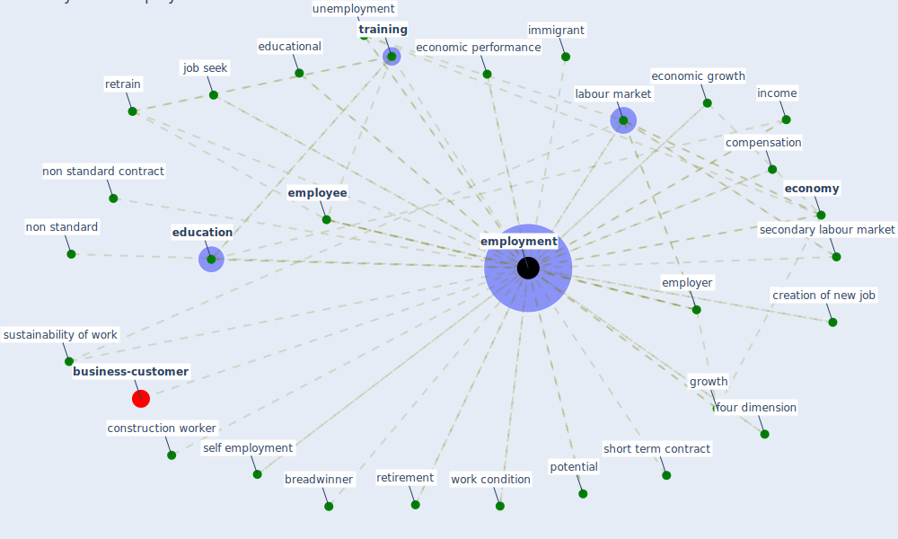

# Keyword: employment

* [business-customer](cluster_11)

## Keywords

 * Cluster_11, apprenticeship, [brand](keyword_brand), breadwinner, career path, career progression, civilian unemployment rate, compensation, [construction](keyword_construction), [construction worker](keyword_construction_worker), creation of new job, dgb s good work index in germany, economic activity, economic benefit, economic growth, economic performance, [economy](keyword_economy), [education](keyword_education), educational, [employee](keyword_employee), [employer](keyword_employer), [employment](keyword_employment), employment status, [europe](keyword_europe), factory shutdown, four dimension, further study, gender segregation of the labour market, growth, [health](keyword_health), [health and safety](keyword_health_and_safety), [immigrant](keyword_immigrant), income, intrinsic job quality, involuntary part time employment, job creation, job seek, [labour market](keyword_labour_market), labour market inclusion, [learn](keyword_learn), mobile work, new job, non standard, non standard contract, [oecd](keyword_oecd), part time work, potential, precarious, precarious job, quality of employment, retirement, retrain, return to work, secondary labour market, [sector](keyword_sector), seek and maintain, self employment, short term contract, [sme](keyword_sme), spend, staff turnover retention, support worker, [sustainability](keyword_sustainability), sustainability of work, [sustainable](keyword_sustainable), sustainable employment, talent shortage market, [training](keyword_training), turnover, unemployed, unemployment, voluntary work, wage, wealth, woman s participation in the labour market, work condition, worker health and safety, [workplace](keyword_workplace)

## Mapping

## Neighbours

### Closest articles

* Sustainable work throughout the life course: National policies and strategies, Publications Office of the European Union - [LINK](article_eurofund_sustainable_2016)
* World Bank Development Report - [LINK](article_world_bank_world_2022)
* Case Study on Finnish TVETA Resilient Model of Training During COVID-19 - [LINK](article_unesco_case_2021)
* COVID-19 and regional solutions for mitigating the risk of SME finance in selected ASEAN member states - [LINK](article_taghizadeh-hesary_covid-19_2022)
* What has been the impact of the COVID-19 pandemic on immigrants? An update on recent evidence - [LINK](article_oecd_what_2022)
* Health, Wellbeing \& Productivity in Offices - [LINK](article_world_green_building_council_health_2014)
* Strategies to Mitigate COVID-19 Pandemic Impacts on Health and Safety of Workers in Construction Projects - [LINK](article_kaushal_strategies_2021)
* 2020 Data Protection Report - [LINK](article_council_of_europe_2020_2020)
* The COVID-19 pandemic: Lessons on building more equal and sustainable societies - [LINK](article_van_barneveld_covid-19_2020)
* Analysis of COVID-19 Concerns Raised by the Construction Workforce and Development of Mitigation Practices - [LINK](article_bou_hatoum_analysis_2021)

### Closest BPs

