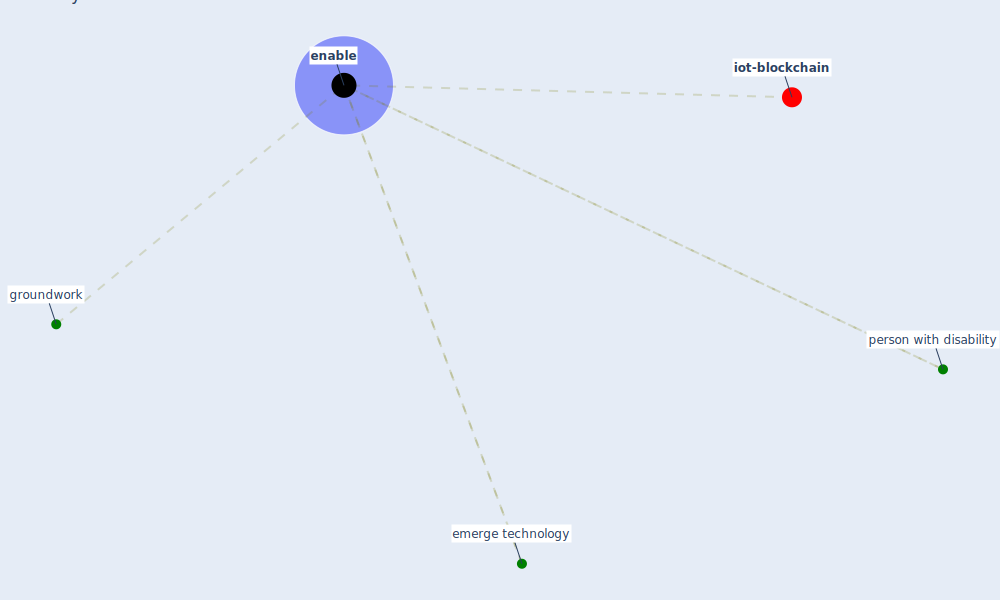

# Keyword: enable

* [iot-blockchain](cluster_7)

## Keywords

 * Cluster_7, emerge technology, [enable](keyword_enable), enabling, groundwork, person with disability

## Mapping

## Neighbours

### Closest articles

* How is COVID-19 Experience Transforming Sustainability Requirements of Residential Buildings? A Review - [LINK](article_tokazhanov_how_2020)
* Impact of COVID-19 on IoT Adoption in Healthcare, Smart Homes, Smart Buildings, Smart Cities, Transportation and Industrial IoT - [LINK](article_umair_impact_2021)
* DfMA for rapid adaptive resilience and flexible infrastructure - [LINK](article_mott_macdonald_dfma_2020)

### Closest BPs

