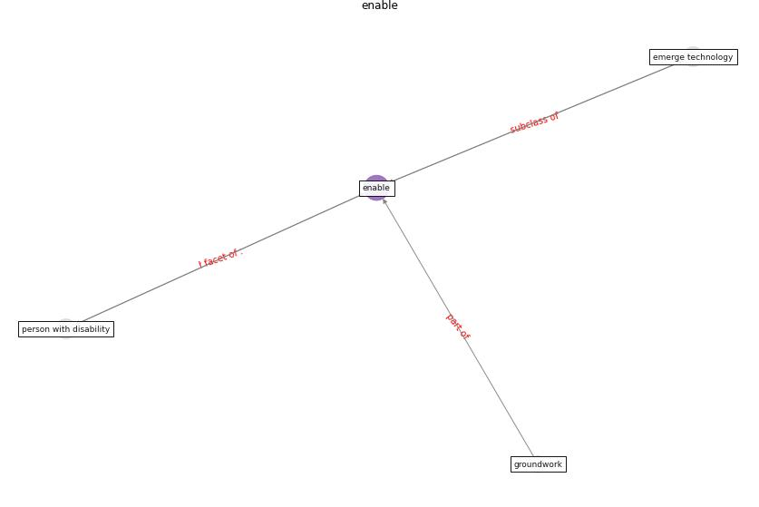

# Keyword: __enable__
## Clusters

* Cluster 6: [smart-iot](cluster_6)

## Concepts

 

## Articles
* How is COVID-19 Experience Transforming
Sustainability Requirements of Residential
Buildings? A Review ([tokazhanov_how_2020](article_tokazhanov_how_2020))
* Impact of COVID-19 on IoT Adoption in Healthcare,
Smart Homes, Smart Buildings, Smart Cities,
Transportation and Industrial IoT ([umair_impact_2021](article_umair_impact_2021))
* mott_macdonald_dfma_2020 ([mott_macdonald_dfma_2020](article_mott_macdonald_dfma_2020))
* Perception of COVID-19 impacts on the construction
industry over time ([rokooei_perception_2022](article_rokooei_perception_2022))
* The City Under COVID‐19: Podcasting As
Digital Methodology ([rogers_city_2020](article_rogers_city_2020))
* p15-lee-vor ([p15-lee-vor](article_p15-lee-vor))
* Effects to Construction Project Management
Impacted Circular Economic of Covid-19 Pandemic ([paikan_effects_2021](article_paikan_effects_2021))
* Impacts of COVID-19 on Health and Safety of
Workforce in Construction Industry ([pamidimukkala_impacts_2021](article_pamidimukkala_impacts_2021))
* Health, Economic and Social Development Challenges
of the COVID-19 Pandemic: Strategies for Multiple
and Interconnected Issues ([panneer_health_2022](article_panneer_health_2022))
* EXPOSED: An occupant exposure model for confined
spaces to retrofit crowd models during a pandemic ([ronchi_exposed_2020](article_ronchi_exposed_2020))
