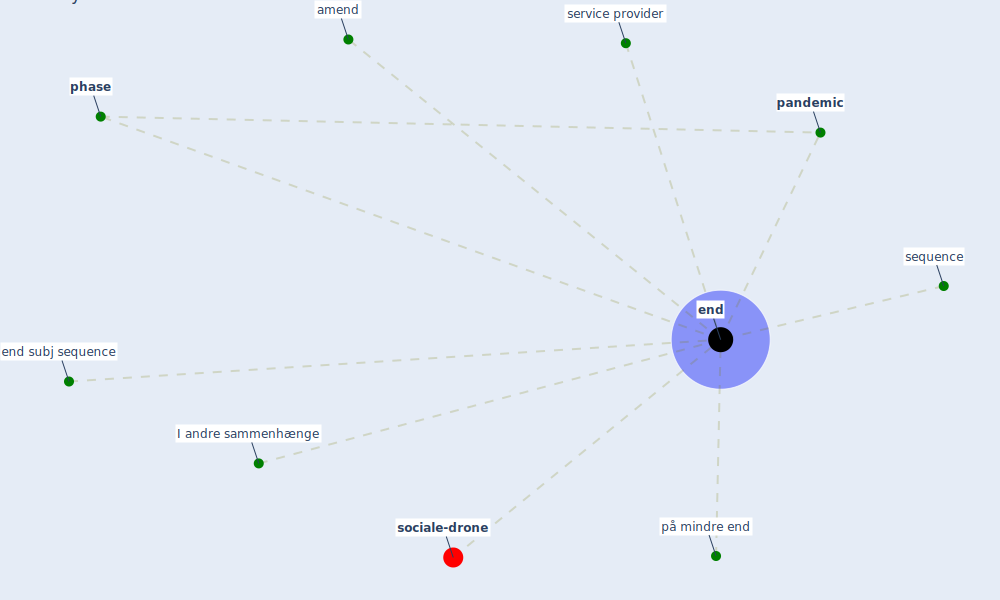

# Keyword: end

* [sociale-drone](cluster_6)

## Keywords

 * Cluster_6, I andre sammenhænge, amend, [end](keyword_end), end subj sequence, ending, ends, [pandemic](keyword_pandemic), [phase](keyword_phase), på mindre end, sequence, service provider

## Mapping

## Neighbours

### Closest articles

* Refleksioner fra en pandemi - [LINK](article_realdania_refleksioner_2022)
* Architectural Design Drives the Biogeography of Indoor Bacterial Communities - [LINK](article_kembel_architectural_2014)
* Digital Twin of COVID-19 Mass Vaccination Centers - [LINK](article_pilati_digital_2021)
* A Comprehensive Review of the COVID-19 Pandemic and the Role of IoT, Drones, AI, Blockchain, and 5G in Managing its Impact - [LINK](article_chamola_comprehensive_2020)
* Readiness Assessment of Green Building Certification Systems for Residential Buildings during Pandemics - [LINK](article_tleuken_readiness_2021)
* How COVID-19 Could Accelerate the Adoption of New Retail Technologies and Enhance the (E-)Servicescape - [LINK](article_willems_how_2021)
* World Bank Development Report - [LINK](article_world_bank_world_2022)

### Closest BPs

