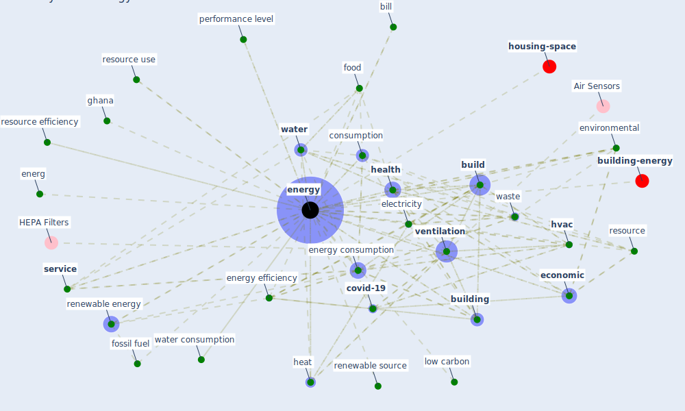

# Keyword: energy

* [housing-space](cluster_2)

* [building-energy](cluster_14)

## Keywords

 * air conditioner, attention, bill, bioclimatic, [build](keyword_build), [building](keyword_building), business case, carbon saving, case study, [clean](keyword_clean), clean product, climate policy, con sumption, consumption, consumption of energy, [covid-19](keyword_covid-19), demand, [economic](keyword_economic), economic growth, edf, eere, [efficiency](keyword_efficiency), electricity, energ, [energy](keyword_energy), [energy consumption](keyword_energy_consumption), energy demand, [energy efficiency](keyword_energy_efficiency), energy infrastructure, energy research, energy study, energy supply chain, environmental, food, [fossil fuel](keyword_fossil_fuel), fuel, geoscience, ghana, [green building](keyword_green_building), [health](keyword_health), heat, [hvac](keyword_hvac), [iea](keyword_iea), incident light, [industry](keyword_industry), [infrastructure](keyword_infrastructure), inversion, kinetic energy, less energy, low carbon, low cost infrastructure, machinesmachine, meter, method, nuclear power, off grid, office space, oil, oil and gas, outcome, [pandemic](keyword_pandemic), performance level, [policy](keyword_policy), policy sector, power, public s health, renewable, renewable energy, renewable energy supply, renewable source, [research](keyword_research), [resilience](keyword_resilience), resource, resource efficiency, resource use, resourceefficiency, retrofit, rev 23 2013, [service](keyword_service), shale gas, smart home, socialscience, solar panel, space heating, storage, [supply chain](keyword_supply_chain), sustainable transport, [transmission](keyword_transmission), transportation, [travel](keyword_travel), usage, [ventilation](keyword_ventilation), ventilation rate, [vulnerability](keyword_vulnerability), waste, [water](keyword_water), water consumption, water efficient, wh, wh m2

## Mapping

## Neighbours

### Closest articles

* Addressing the impact of COVID-19 lockdown on energy use in municipal buildings: A case study in Florianópolis, Brazil - [LINK](article_geraldi_addressing_2021)
* Health, Wellbeing \& Productivity in Offices - [LINK](article_world_green_building_council_health_2014)
* COVID-19 Could Leverage a Sustainable Built Environment - [LINK](article_pinheiro_covid-19_2020)
* Assessment of Building Automation and Control Systems in Danish Healthcare Facilities in the COVID-19 Era - [LINK](article_pedersen_assessment_2022)
* The effect of occupant distribution on energy consumption and COVID-19 infection in buildings: A case study of university building - [LINK](article_mokhtari_effect_2021)
* Validity of energy social research during and after COVID-19: challenges, considerations, and responses - [LINK](article_fell_validity_2020)
* Contextualizing the Covid-19 pandemic for a carbon-constrained world: Insights for sustainability transitions, energy justice, and research methodology - [LINK](article_sovacool_contextualizing_2020)
* Prophylactic Architecture: Formulating the Concept of Pandemic-Resilient Homes - [LINK](article_elrayies_prophylactic_2022)
* Urban planning after COVID-19 - [LINK](article_rtpi_urban_2021)
* Occupants’ behavior and activity patterns influencing the energy consumption in the Kuwaiti residences - [LINK](article_al-mumin_occupants_2003)

### Closest BPs

