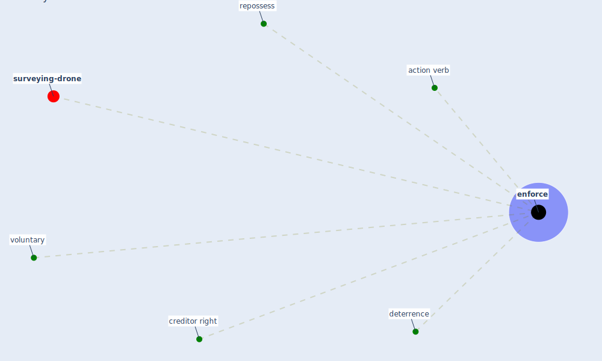

# Keyword: enforce

* [surveying-drone](cluster_13)

## Keywords

 * Cluster_13, action verb, creditor right, [deterrence](keyword_deterrence), [enforce](keyword_enforce), enforced, repossess, voluntary

## Mapping

## Neighbours

### Closest articles

* Analysis of COVID-19 Concerns Raised by the Construction Workforce and Development of Mitigation Practices - [LINK](article_bou_hatoum_analysis_2021)
* World Bank Development Report - [LINK](article_world_bank_world_2022)
* The Intelligent Lockdown: Compliance with COVID-19 Mitigation Measures in the Netherlands - [LINK](article_kuiper_intelligent_2020)
* Compliance with COVID-19 Mitigation Measures in the United States - [LINK](article_van_rooij_compliance_2020)

### Closest BPs

