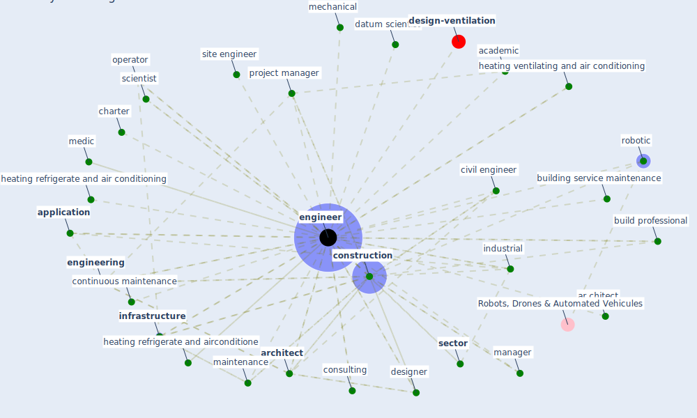

# Keyword: engineer

* [design-ventilation](cluster_12)

## Keywords

 * Cluster_12, academic, [application](keyword_application), ar chitect, [architect](keyword_architect), build professional, [building](keyword_building), building scientist, building service, building service maintenance, charter, civil, civil engineer, [construction](keyword_construction), construction engineering, consulting, continuous maintenance, control strategy, corps, datum scientist, designer, electrical, [engineer](keyword_engineer), engineered, [engineering](keyword_engineering), engineers, heating refrigerate and air conditioning, heating refrigerate and airconditione, heating ventilating and air conditioning, inad equate, incorporate, industrial, [infrastructure](keyword_infrastructure), maintenance, [manager](keyword_manager), mechanical, medic, operator, project manager, [robotic](keyword_robotic), scientist, [sector](keyword_sector), site engineer, [stakeholder](keyword_stakeholder)

## Mapping

## Neighbours

### Closest articles

* A Global Survey of Infection Control and Mitigation Measures for Combating the Transmission of COVID-19 Pandemic in Buildings Under Facilities Management Services - [LINK](article_sarvari_global_2022)
* Influence between COVID-19 Impacts and Project Stakeholders in Chilean Construction Projects - [LINK](article_araya_influence_2021)
* Will a pandemic change building codes? - [LINK](article_rozgus_will_2020)
* Indoor Air Quality: Rethinking rules of building design strategies in post-pandemic architecture - [LINK](article_megahed_indoor_2021)
* Occupant health in buildings: Impact of the COVID-19 pandemic on the opinions of building professionals and implications on research - [LINK](article_awada_occupant_2022)
* COVID-19 as a Harbinger of Transforming Infrastructure Resilience - [LINK](article_carvalhaes_covid-19_2020)
* Propositions for a Resilient, Post-COVID-19 Future for the AEC Industry - [LINK](article_nassereddine_propositions_2021)
* The impact of climate change on the epidemiology and control of Rift Valley fever - PubMed - [LINK](article_martin_impact_2008)
* Supporting Technologies for COVID-19 Prevention: Systemized Review - [LINK](article_zhao_supporting_2022)
* How COVID-19 Could Accelerate the Adoption of New Retail Technologies and Enhance the (E-)Servicescape - [LINK](article_willems_how_2021)

### Closest BPs

