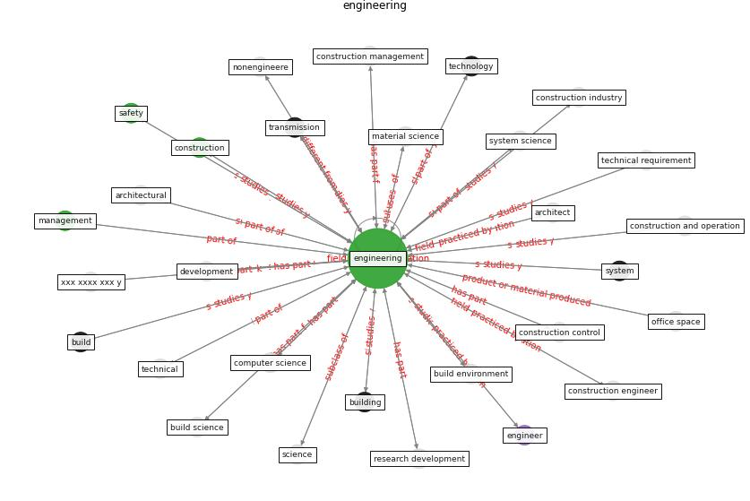

# Keyword: __engineering__
## Clusters

* Cluster 6: [construction-project](cluster_6)

## Concepts

 

## Top 10 articles for __engineering__
* Indoor Air Quality: Rethinking rules of building
design strategies in post-pandemic architecture ([megahed_indoor_2021](article_megahed_indoor_2021))
* An Intelligent IEQ Monitoring and Feedback
System: Development and Applications ([geng_intelligent_2021](article_geng_intelligent_2021))
* Mechanisms for addressing the impact of COVID-19 on
infrastructure projects ([king_mechanisms_2021](article_king_mechanisms_2021))
* Guidelines for Responding to COVID-19 Pandemic:
Best Practices, Impacts, and Future Research
Directions ([assaad_guidelines_2021](article_assaad_guidelines_2021))
* A review of definitions and measures of system
resilience ([hosseini_review_2016](article_hosseini_review_2016))
* Revisiting the built environment: 10 potential development
changes and paradigm shifts due to COVID-19 ([cheshmehzangi_revisiting_2021](article_cheshmehzangi_revisiting_2021))
* ogunnusi_covid-19_2020 ([ogunnusi_covid-19_2020](article_ogunnusi_covid-19_2020))
* nassereddine_propositions_2021 ([nassereddine_propositions_2021](article_nassereddine_propositions_2021))
* A Global Survey of Infection Control and
Mitigation Measures for Combating the Transmission
of COVID-19 Pandemic in Buildings Under
Facilities Management Services ([sarvari_global_2022](article_sarvari_global_2022))
* Overcoming the Impact of COVID-19 Using Integrated
Project Delivery Model ([g_overcoming_2020](article_g_overcoming_2020))
