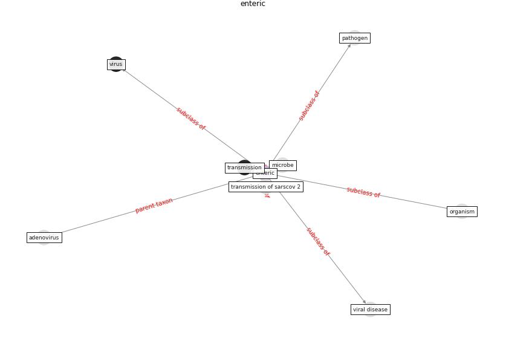

# Keyword: __enteric__
## Clusters

* Cluster 7: [liver-province](cluster_7)

## Concepts

 

## Top 10 articles for __enteric__
* A Review on Building Design as a Biomedical
System for Preventing COVID-19 Pandemic ([amran_review_2022](article_amran_review_2022))
* A Continuously Active Antimicrobial Coating
effective against Human Coronavirus 229E ([ikner_continuously_2020](article_ikner_continuously_2020))
* SARS-CoV-2 in wastewater: potential health risk, but
also data source ([lodder_sars-cov-2_2020](article_lodder_sars-cov-2_2020))
* Wastewater-Based Epidemiology to monitor COVID-19
outbreak: Present and future diagnostic methods to be in
your radar ([barcelo_wastewater-based_2020](article_barcelo_wastewater-based_2020))
* Disinfection technology of hospital wastes and wastewater:
Suggestions for disinfection strategy during coronavirus
Disease 2019 (COVID-19) pandemic in China ([wang_disinfection_2020](article_wang_disinfection_2020))
* udomiaye_architectural_2020 ([udomiaye_architectural_2020](article_udomiaye_architectural_2020))
* Effect of Ultraviolet Germicidal Irradiation on
Viral Aerosols ([walker_effect_2007](article_walker_effect_2007))
* How our homes impact our health: using a COVID-19
informed approach to examine urban apartment housing ([peters_how_2020](article_peters_how_2020))
* Digital Twin of COVID-19 Mass Vaccination
Centers ([pilati_digital_2021](article_pilati_digital_2021))
* COVID-19 Experience Transforming the Protective
Environment of Office Buildings and Spaces ([phapant_covid-19_2021](article_phapant_covid-19_2021))
