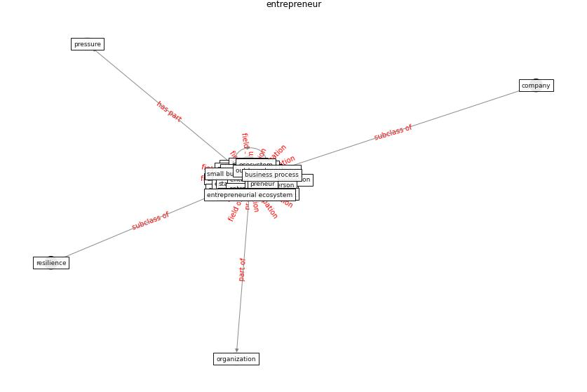

# Keyword: __entrepreneur__
## Clusters

* Cluster 9: [resilience-infrastructure](cluster_9.md)

## Concepts

 

## Articles
* COVID19: Small and medium enterprises challenges and
responses with creativity, innovation, and
entrepreneurship ([thukral_covid19_2021](article_thukral_covid19_2021.md))
* Startups in times of crisis – A rapid response to the
COVID-19 pandemic ([kuckertz_startups_2020](article_kuckertz_startups_2020.md))
* Startups in times of crisis – A rapid response to the
COVID-19 pandemic ([kuckertz_startups_2020](article_kuckertz_startups_2020.md))
* Startups in times of crisis – A rapid response to the
COVID-19 pandemic ([kuckertz_startups_2020](article_kuckertz_startups_2020.md))
* Borders and Catastrophe: lessons from COVID-19 for the
European Green Deal ([klein_borders_2021](article_klein_borders_2021.md))
* world_bank_world_2022-350 ([world_bank_world_2022-350](article_world_bank_world_2022-350.md))
* Startups in times of crisis – A rapid response to the
COVID-19 pandemic ([kuckertz_startups_2020](article_kuckertz_startups_2020.md))
* Startups in times of crisis – A rapid response to the
COVID-19 pandemic ([kuckertz_startups_2020](article_kuckertz_startups_2020.md))
* Startups in times of crisis – A rapid response to the
COVID-19 pandemic ([kuckertz_startups_2020](article_kuckertz_startups_2020.md))
* Perception of COVID-19 impacts on the construction
industry over time ([rokooei_perception_2022](article_rokooei_perception_2022.md))
