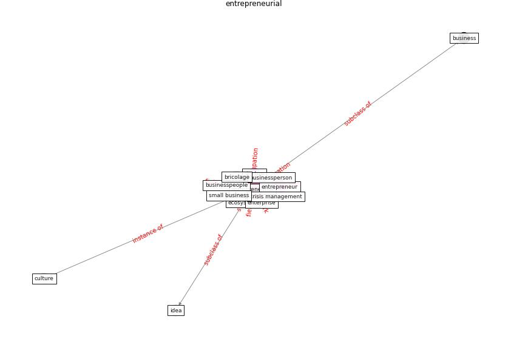

# Keyword: __entrepreneurial__
## Clusters

* Cluster 9: [resilience-infrastructure](cluster_9.md)

## Concepts

 

## Articles
* Startups in times of crisis – A rapid response to the
COVID-19 pandemic ([kuckertz_startups_2020](article_kuckertz_startups_2020.md))
* COVID19: Small and medium enterprises challenges and
responses with creativity, innovation, and
entrepreneurship ([thukral_covid19_2021](article_thukral_covid19_2021.md))
* Startups in times of crisis – A rapid response to the
COVID-19 pandemic ([kuckertz_startups_2020](article_kuckertz_startups_2020.md))
* Startups in times of crisis – A rapid response to the
COVID-19 pandemic ([kuckertz_startups_2020](article_kuckertz_startups_2020.md))
* Startups in times of crisis – A rapid response to the
COVID-19 pandemic ([kuckertz_startups_2020](article_kuckertz_startups_2020.md))
* Startups in times of crisis – A rapid response to the
COVID-19 pandemic ([kuckertz_startups_2020](article_kuckertz_startups_2020.md))
* realdania_refleksioner_2022_EN-1350 ([realdania_refleksioner_2022_EN-1350](article_realdania_refleksioner_2022_EN-1350.md))
* realdania_refleksioner_2022_EN-150 ([realdania_refleksioner_2022_EN-150](article_realdania_refleksioner_2022_EN-150.md))
* realdania_refleksioner_2022_EN-1450 ([realdania_refleksioner_2022_EN-1450](article_realdania_refleksioner_2022_EN-1450.md))
* realdania_refleksioner_2022_EN-1400 ([realdania_refleksioner_2022_EN-1400](article_realdania_refleksioner_2022_EN-1400.md))
